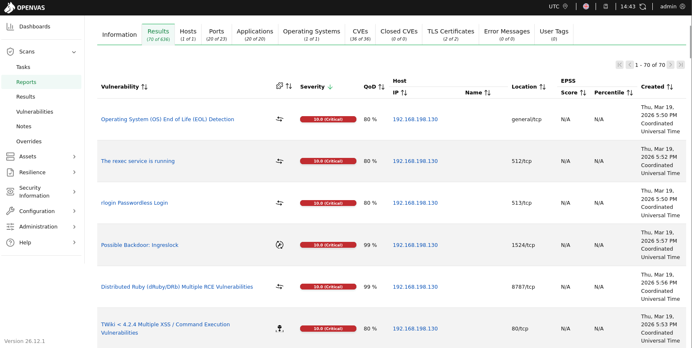

# 1. Vulnerability Scanning Techniques

### What is Vulnerability Scanning?

Vulnerability scanning is the process of identifying security weaknesses in systems, networks, and applications using automated tools. It helps in detecting misconfigurations, outdated services, and potential entry points for attackers.

---

### What are the Different Types of Scans?

Based on NIST SP 800-115 and OWASP:

1. Network Scanning:
   - Identifies open ports, services, and operating systems
   - Example: Nmap port scanning
   - Purpose: Discover exposed services in the network

2. Application Scanning:
   - Focuses on web applications
   - Detects vulnerabilities like SQL Injection, XSS, file inclusion
   - Example: Nikto
   - Purpose: Identify flaws in web application logic and configuration

3. Authenticated vs Unauthenticated Scans:

   - Authenticated Scan:
     - Uses valid credentials
     - Provides deeper visibility into system vulnerabilities
     - Recommended for internal assessments

   - Unauthenticated Scan:
     - Performed without login access
     - Simulates an external attacker
     - Limited visibility but realistic attack perspective

---

### What is Vulnerability Scoring (CVSS)?

CVSS (Common Vulnerability Scoring System) is used to measure the severity of vulnerabilities.

- Scores range from 0 to 10
- Classification:
  - 0.0 – 3.9 → Low
  - 4.0 – 6.9 → Medium
  - 7.0 – 8.9 → High
  - 9.0 – 10 → Critical

Example:
- A Remote Code Execution vulnerability with CVSS 8.8 is considered High
- Apache Struts (CVE-2017-5638) was Critical and widely exploited

Purpose:
- Helps prioritize vulnerabilities based on risk
- Used in reporting and remediation planning

---

### What are False Positives in Vulnerability Scanning?

False positives occur when a scanning tool reports a vulnerability that does not actually exist or is not exploitable.

Examples:
- A port is shown as open but is filtered or restricted
- A vulnerability is reported based on version detection but is already patched

Why it happens:
- Inaccurate service detection
- Generic signatures used by tools
- Lack of context about system configuration

Solution:
- Perform manual verification
- Cross-check with multiple tools
- Validate findings before reporting

---

### Case Study: WannaCry Ransomware

WannaCry was a global ransomware attack that occurred in May 2017. It exploited a vulnerability in the SMB protocol of Windows systems.

- Vulnerability: EternalBlue exploit (MS17-010)
- Affected Service: SMB (Port 445)
- Impact: Encrypted user data and demanded ransom in Bitcoin
- Spread: Rapid worm-like propagation across networks

---

### Relation to Vulnerability Scanning

WannaCry highlights the importance of vulnerability scanning:

- The vulnerability (MS17-010) was already known and patch available
- Systems that were not scanned or patched became targets
- Open port 445 exposed SMB service to attackers

---

### CVSS Mapping

- The SMB vulnerability exploited by WannaCry had a **Critical CVSS score (~9.8)**
- Reason:
  - Remote exploitation possible
  - No authentication required
  - High impact (complete system compromise)

---

### Key Lessons Learned

- Unpatched systems are high-risk targets
- Critical vulnerabilities must be prioritized immediately
- Open ports (like 445) increase attack surface
- Vulnerability scanning + patch management is essential

---

### Analyst Insight

WannaCry demonstrates how a single unpatched vulnerability with a high CVSS score can lead to large-scale exploitation. Proper vulnerability scanning and timely remediation could have prevented the attack.

---

### Key Objectives of Vulnerability Scanning

- Identify exposed services and vulnerabilities
- Understand the attack surface of the system
- Validate scan results to reduce false positives
- Prioritize vulnerabilities using CVSS scoring
- Support further penetration testing phases

---


----

# 1. Vulnerability Scanning Lab
**Target-IP** = *192.168.198.130*
**Attacker-IP** = *192.168.198.129*

## NMAP Scan
Run the Nmap
```bash
nmap -sV 192.168.198.130
```

**Output**
```bash
Starting Nmap 7.98 ( https://nmap.org ) at 2026-03-19 13:25 -0400
Nmap scan report for 192.168.198.130
Host is up (0.0020s latency).
Not shown: 977 closed tcp ports (reset)
PORT     STATE SERVICE     VERSION
21/tcp   open  ftp         vsftpd 2.3.4
22/tcp   open  ssh         OpenSSH 4.7p1 Debian 8ubuntu1 (protocol 2.0)
23/tcp   open  telnet      Linux telnetd
25/tcp   open  smtp        Postfix smtpd
53/tcp   open  domain      ISC BIND 9.4.2
80/tcp   open  http        Apache httpd 2.2.8 ((Ubuntu) DAV/2)
111/tcp  open  rpcbind     2 (RPC #100000)
139/tcp  open  netbios-ssn Samba smbd 3.X - 4.X (workgroup: WORKGROUP)
445/tcp  open  netbios-ssn Samba smbd 3.X - 4.X (workgroup: WORKGROUP)
512/tcp  open  exec        netkit-rsh rexecd
513/tcp  open  login       OpenBSD or Solaris rlogind
514/tcp  open  tcpwrapped
1099/tcp open  java-rmi    GNU Classpath grmiregistry
1524/tcp open  bindshell   Metasploitable root shell
2049/tcp open  nfs         2-4 (RPC #100003)
2121/tcp open  ftp         ProFTPD 1.3.1
3306/tcp open  mysql       MySQL 5.0.51a-3ubuntu5
5432/tcp open  postgresql  PostgreSQL DB 8.3.0 - 8.3.7
5900/tcp open  vnc         VNC (protocol 3.3)
6000/tcp open  X11         (access denied)
6667/tcp open  irc         UnrealIRCd
8009/tcp open  ajp13       Apache Jserv (Protocol v1.3)
8180/tcp open  http        Apache Tomcat/Coyote JSP engine 1.1
MAC Address: 00:0C:29:58:78:49 (VMware)
Service Info: Hosts:  metasploitable.localdomain, irc.Metasploitable.LAN; OSs: Unix, Linux; CPE: cpe:/o:linux:linux_kernel

Service detection performed. Please report any incorrect results at https://nmap.org/submit/ .
Nmap done: 1 IP address (1 host up) scanned in 12.25 seconds
```

### Scan Results

| Scan ID | Vulnerability                         | CVSS Score | Priority  | Host           |
|--------|--------------------------------------|------------|-----------|----------------|
| 001    | vsftpd 2.3.4 Backdoor (Port 21)      | 9.8        | Critical  | 192.168.198.130 |
| 002    | Telnet Service Enabled (Port 23)     | 7.5        | High      | 192.168.198.130 |
| 003    | Samba Service (Port 445)             | 8.0        | High      | 192.168.198.130 |
| 004    | Bind Shell Access (Port 1524)        | 10.0       | Critical  | 192.168.198.130 |
| 005    | MySQL Exposed (Port 3306)            | 8.5        | High      | 192.168.198.130 |
| 006    | Apache HTTP (Outdated) (Port 80)     | 6.5        | Medium    | 192.168.198.130 |
| 007    | Tomcat Server (Port 8180)            | 7.5        | High      | 192.168.198.130 |
| 008    | PostgreSQL Exposed (Port 5432)       | 8.0        | High      | 192.168.198.130 |

---

### Key Findings

- The system contains multiple critical vulnerabilities including a backdoored FTP service and an active bind shell.
- The presence of port 1524 indicates that the system is already compromised and allows direct root access.
- Several services such as MySQL, PostgreSQL, and Samba are exposed, increasing the risk of unauthorized access.
- Insecure protocols like Telnet allow credential interception.
- Outdated services increase the likelihood of known exploit availability.

---

## OpenVAS Scan

**Target-IP** = *192.168.198.130*
**Attacker-IP** = *192.168.198.129*

The OpenVAS scan identified multiple critical vulnerabilities on the target system (192.168.198.130), including remote code execution, default credentials, and backdoors.




---

### Critical Vulnerabilities

| ID  | Vulnerability                                  | CVSS | Port  | Description |
|-----|-----------------------------------------------|------|------|-------------|
| 009 | vsftpd Backdoor (CVE-2011-2523)               | 9.8  | 21   | Backdoored FTP service allowing remote shell access |
| 010 | Rexec Service Enabled (CVE-1999-0618)         | 10.0 | 512  | Allows remote command execution with plaintext authentication |
| 011 | Bind Shell Backdoor (Ingreslock)              | 10.0 | 1524 | Provides direct root shell access |
| 012 | MySQL Default Credentials                    | 9.8  | 3306 | Login possible with root and empty password |
| 013 | PostgreSQL Default Credentials               | 9.0  | 5432 | Login possible using default credentials |
| 014 | Apache Tomcat Ghostcat RCE (CVE-2020-1938)   | 9.8  | 8009 | Allows file read and remote code execution |
| 015 | DistCC RCE (CVE-2004-2687)                   | 9.3  | 3632 | Remote command execution via compilation service |
| 016 | rlogin Passwordless Access                   | 10.0 | 513  | Allows root login without password |
| 017 | VNC Weak Password                           | 9.0  | 5900 | Accessible using weak credentials |
| 018 | OS End of Life (Ubuntu 8.04)                | 10.0 | N/A  | No security updates, highly vulnerable system |

---

### Web Application Vulnerabilities

| ID  | Vulnerability                                  | CVSS | Port | Description |
|-----|-----------------------------------------------|------|------|-------------|
| 019 | TWiki XSS + Command Execution (CVE-2008-5304) | 10.0 | 80   | Allows script injection and command execution |
| 020 | PHP CGI RCE (CVE-2012-1823)                  | 9.8  | 80   | Allows execution of arbitrary PHP code |

---

### Key Insights

- The system is highly vulnerable with **multiple critical RCE vulnerabilities**
- Default credentials are present across multiple services (MySQL, PostgreSQL)
- Backdoors (vsftpd, bind shell) indicate complete system compromise
- Outdated OS (Ubuntu 8.04) increases exposure to known exploits
- Weak authentication mechanisms allow unauthorized access

---

### Risk Summary

- Critical: 14 vulnerabilities  
- High: 10 vulnerabilities  
- Medium: 40 vulnerabilities  
- Low: 6 vulnerabilities  

The presence of multiple critical vulnerabilities confirms that the system can be fully compromised by an attacker.

---
## Prioritization

- Critical:
  - vsftpd backdoor
  - bind shell (direct root access)

- High:
  - Samba service
  - MySQL and PostgreSQL exposure
  - Telnet service

- Medium:
  - Apache HTTP (outdated version)

---

## Vulnerability Assessment Report

### Target Information

- Target IP: 192.168.198.130  
- Environment: Metasploitable2 (Lab Setup)  
- Tools Used: Nmap, OpenVAS  

---

### Executive Summary

A vulnerability assessment was conducted on the target system using Nmap for service enumeration and OpenVAS for vulnerability detection. The scan identified multiple critical vulnerabilities, including remote code execution (RCE), default credentials, exposed services, and backdoors.

The presence of these vulnerabilities indicates that the system is highly insecure and can be fully compromised by an attacker with minimal effort.

---

### Methodology

The assessment followed a structured approach aligned with PTES:

1. Reconnaissance:
   - Identified target system and IP address

2. Scanning:
   - Performed service and version detection using Nmap
   - Conducted vulnerability scanning using OpenVAS

3. Analysis:
   - Correlated open services with known vulnerabilities
   - Prioritized risks based on CVSS scoring

---

### Nmap Scan Results

The Nmap scan identified multiple open ports and services:

| Port | Service     | Version |
|------|------------|--------|
| 21   | FTP        | vsftpd 2.3.4 |
| 22   | SSH        | OpenSSH 4.7 |
| 23   | Telnet     | telnetd |
| 25   | SMTP       | Postfix |
| 80   | HTTP       | Apache 2.2.8 |
| 139  | Samba      | smbd |
| 445  | Samba      | smbd |
| 1524 | Bind Shell | Root shell |
| 3306 | MySQL      | 5.0.51 |
| 5432 | PostgreSQL | 8.3 |
| 5900 | VNC        | VNC |
| 8009 | AJP13      | Apache Jserv |
| 8180 | HTTP       | Tomcat |

---

### OpenVAS Findings

The OpenVAS scan revealed multiple critical vulnerabilities:

- vsftpd backdoor (CVE-2011-2523)
- Apache Tomcat Ghostcat RCE (CVE-2020-1938)
- PHP CGI RCE (CVE-2012-1823)
- DistCC RCE (CVE-2004-2687)
- MySQL default credentials (root with empty password)
- PostgreSQL default credentials
- rlogin passwordless access
- VNC weak password
- OS End-of-Life (Ubuntu 8.04)

Summary from scan :contentReference[oaicite:0]{index=0}:
- Critical: 14
- High: 10
- Medium: 40
- Low: 6

---

### Combined Risk Analysis

The correlation of Nmap and OpenVAS results highlights:

- Open services directly map to exploitable vulnerabilities
- Multiple RCE vectors exist across services
- Weak authentication mechanisms are present
- The system is already compromised (bind shell on port 1524)

Critical attack paths include:

- FTP backdoor → shell access  
- Tomcat AJP → file read and RCE  
- Database services → data compromise  
- DistCC → command execution  

---

### Key Findings

1. Multiple Remote Code Execution vulnerabilities exist
2. Default credentials allow unauthorized access
3. Backdoors provide direct root-level access
4. Insecure protocols (Telnet, rlogin) expose credentials
5. Outdated OS increases attack surface

---

### Impact

Successful exploitation of these vulnerabilities can lead to:

- Full system compromise  
- Unauthorized data access  
- Remote command execution  
- Privilege escalation to root  
- Persistence and lateral movement  

---

### Remediation

- Disable insecure services (Telnet, rlogin, rexec)
- Patch vulnerable software (vsftpd, Apache, PHP, Tomcat)
- Change default credentials immediately
- Restrict database access to internal network
- Remove backdoors and rebuild compromised system
- Upgrade OS to a supported version
- Implement firewall rules to restrict unnecessary ports

---

### Conclusion

The target system is critically vulnerable due to multiple high-impact security issues. Immediate remediation is required to prevent exploitation. The combination of outdated software, weak authentication, and exposed services makes the system highly susceptible to compromise.

---

## Escalation Email

Subject: Critical Security Vulnerabilities Detected

During the recent vulnerability assessment of the target system (192.168.198.130), multiple critical security issues were identified and successfully validated in a controlled lab environment.

Key findings include:

- Backdoored FTP service (vsftpd 2.3.4)
    
- Active bind shell providing root-level access
    
- Default credentials in MySQL and PostgreSQL
    
- Apache Tomcat Ghostcat RCE vulnerability
    
- Weak authentication services (Telnet, rlogin, VNC)
    

Proof of Concept (PoC) Summary:

- Identified vulnerable FTP service via Nmap scan (vsftpd 2.3.4)
    
- Mapped vulnerability using OpenVAS (CVE-2011-2523)
    
- Loaded publicly available exploit module in a controlled lab setup
    
- Configured target IP and local handler parameters
    
- Successfully established a reverse shell session
    
- Verified root-level access using system commands (e.g., getuid, sysinfo)
    

Impact:

- Full system compromise confirmed
    
- Unauthorized remote command execution possible
    
- Sensitive data exposure risk
    
- Persistence mechanisms can be established by attackers
    

Recommended Remediation:

- Immediately remove or patch vulnerable services
    
- Disable insecure protocols (Telnet, rlogin)
    
- Enforce strong authentication policies
    
- Restrict access to critical services and ports
    
- Upgrade the operating system and apply security patches
    

Immediate action is strongly recommended to mitigate exploitation risk.

**POC - vsftpd 2.3.4**

Search this `VSFTPD v2.3.4` on Internet for related exploits.
You will find a **Rapid7** exploit at `https://www.rapid7.com/db/modules/exploit/unix/ftp/vsftpd_234_backdoor/`

Start **msfconsole**
```bash
> msfconsole

# search for vsftpd 2.3.4 specific vulnerability
msf > search vsftpd 2.3.4
msf > use exploit/unix/ftp/vsftpd_234_backdoor
```


As show in the above Screenshot we have gained root privileges on the Target **192.168.198.130** via vsftpd vulnerability.
