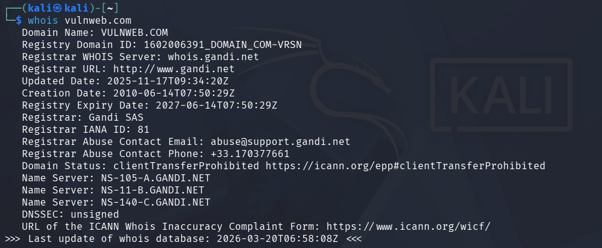
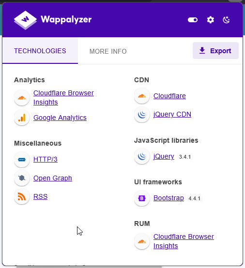
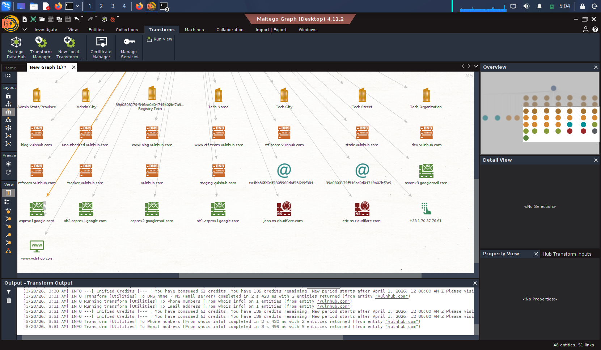

# 2. Reconnaissance Practice

## Target

- Domain: testphp.vulnweb.com
- Root Domain: vulnweb.com
- Organization: Invicti Security Limited (Acunetix)
- Purpose: Intentionally vulnerable web application (authorized for testing)

---

## Domain Information (WHOIS)

Command used:
```bash
whois vulnweb.com
```
WHOIS lookup on subdomain returned no result (expected behavior), so analysis was performed on the root domain.

- Registrar: Gandi SAS
- Creation Date: 2010-06-14
- Expiry Date: 2027-06-14
- Name Servers:
  - NS-105-A.GANDI.NET
  - NS-11-B.GANDI.NET
  - NS-140-C.GANDI.NET
- Organization: Invicti Security Limited

### Insight

Subdomains do not have separate WHOIS records. Reconnaissance must pivot to the root domain for ownership and registration details.

---

## Subdomain Enumeration (Sublist3r)

Command used:
```python
python sublist3r.py -d vulnweb.com
```

Total Subdomains Found: 9

- www.vulnweb.com
- testphp.vulnweb.com
- rest.vulnweb.com
- testasp.vulnweb.com
- testaspnet.vulnweb.com
- testhtml5.vulnweb.com
- test.vulnweb.com
- tesphp.vulnweb.com
- test.php.vulnweb.com

### Insight

Multiple test environments indicate different application stacks (PHP, ASP, ASP.NET), increasing the attack surface.

---

## Technology Stack (Wappalyzer)

- Web Server: Apache
- CDN: Cloudflare
- JavaScript Library: jQuery 3.4.1
- UI Framework: Bootstrap 4.4.1
- Analytics: Google Analytics
- Protocol: HTTP/3

### Insight

Use of outdated libraries or misconfigured CDN can introduce vulnerabilities such as XSS or caching issues.

---

## Asset Mapping (Maltego)

Maltego analysis revealed:

- Multiple subdomains linked to vulnweb.com
- DNS infrastructure mapping
- Mail servers (Google MX records)
- Cloudflare nameservers
- Related entities and domain relationships

### Insight

The presence of multiple subdomains and services increases the potential entry points for attackers.

---

## Asset Mapping Log

| Timestamp            | Tool       | Finding |
|--------------------|-----------|--------|
| 2026-03-20 05:00:00 | WHOIS     | Domain owned by Invicti Security |
| 2026-03-20 05:10:00 | Sublist3r | 9 subdomains discovered |
| 2026-03-20 05:20:00 | Wappalyzer| Apache, jQuery, Bootstrap detected |
| 2026-03-20 05:30:00 | Maltego   | Subdomains and DNS mapping identified |
| 2026-03-20 05:40:00 | Shodan    | Web services exposed (HTTP) |

---

## Reconnaissance Checklist

- [x] WHOIS lookup completed  
- [x] Subdomain enumeration performed  
- [x] Technology stack identified  
- [x] Asset relationships mapped  
- [x] Exposed services identified  

---

## Key Findings

- Target is intentionally vulnerable and suitable for testing
- Multiple subdomains increase attack surface
- Apache web server and PHP-based applications are in use
- CDN (Cloudflare) may hide origin infrastructure
- Presence of multiple tech stacks suggests diverse vulnerabilities

---

## Summary

Reconnaissance was conducted on vulnweb.com using WHOIS, Sublist3r, Wappalyzer, and Maltego. Multiple subdomains and technologies were identified, including Apache, jQuery, and Cloudflare. The target hosts various test applications, increasing the attack surface and making it suitable for vulnerability analysis and penetration testing in an authorized environment.
