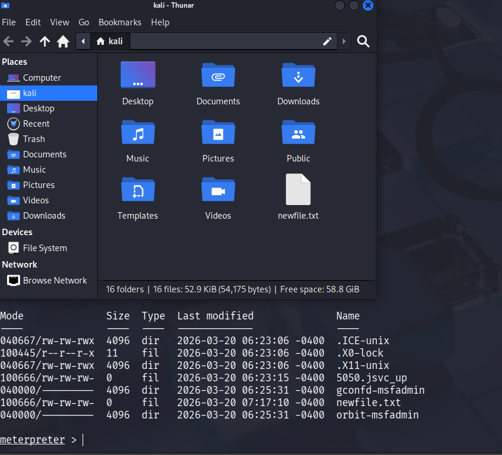
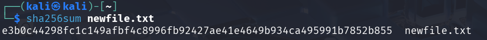

# 4. Post-Exploitation Practice  
  
## Objective  
  
To perform post-exploitation activities including privilege verification, evidence collection, and integrity validation using hashing techniques.  
  
---  
  
## Tools Used  
  
- Meterpreter (Metasploit)  
- sha256sum (for hashing evidence)  
  
---  
  
## Post-Exploitation Activities  
  
After successful exploitation, a meterpreter session was established on the target system.  
  
---  
  
### Privilege Verification  
  
```bash  
meterpreter > getuid
```
Output:

- Server username: root
    

---

### System Information

meterpreter > sysinfo

This confirms:

- OS: Linux (Metasploitable)
    
- Architecture: x86
    

---

## Evidence Collection

A file named `newfile.txt` was collected from the compromised target system during the post-exploitation phase.



## Hash Generation

The integrity of the collected file was verified using SHA256 hashing.

```typescript
sha256sum newfile.txt
```


### Hash Generation on Target System  
  


The SHA256 hash of the collected file (`newfile.txt`) was generated on the target system to verify file integrity before transfer.  
  
---  
  
### Hash Verification on Attacker System  
  

  
The SHA256 hash of the same file was generated on the attacker machine after extraction. The hash value matches the target system, confirming that the file integrity was preserved during transfer.  
  
---  
  
### Integrity Verification  
  
The identical hash values on both systems confirm that the file was not altered during extraction, ensuring reliable evidence collection.  
  
---

## Evidence Table

| Item      | Description  | Collected By | Date       | Hash Value |
|----------|-------------|--------------|------------|-----------|
| Text File | newfile.txt | VAPT Analyst | 2026-03-20 | e3b0c44298fc1c149afbf4c8996fb92427ae41e4649b934ca495991b7852b855 |


---

## Key Findings

- Root-level access was obtained on the target system
    
- File was successfully extracted from compromised system
    
- Evidence integrity verified using SHA256 hashing
    
- System is fully compromised
    

---

## Impact

- Unauthorized access to sensitive files
    
- Ability to extract and manipulate system data
    
- Full control over compromised environment
    
- High risk of data breach
    

---

## Conclusion

Post-exploitation activities confirmed complete system compromise. Evidence collection demonstrated the ability to access and extract files from the target system. Hashing ensured integrity verification of collected data. Immediate remediation is required to prevent unauthorized access and further exploitation.
