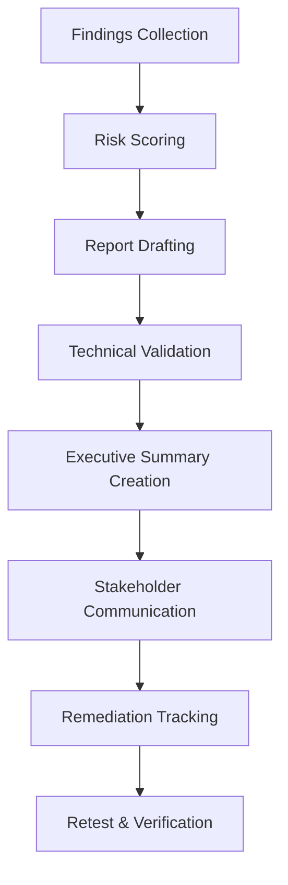
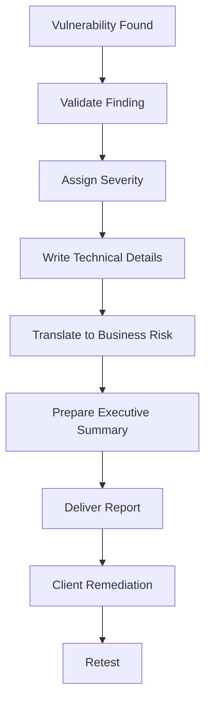

# Reporting and Stakeholder Communication

---

## 1. Overview of Pentest Reporting Methodology

Penetration testing is incomplete without **clear, actionable reporting**. A well-structured report translates technical findings into **business risk and remediation actions**.

### Reporting Workflow (PTES + SANS)



---

## 2. Report Structure (PTES + SANS)

---

## 2.1 Executive Summary

### Purpose

Translate technical vulnerabilities into **business impact** for non-technical stakeholders.

[PTES Executive Summary Section 2.1]

---

### Key Components

- Scope of assessment
  
- Testing methodology
  
- High-level findings
  
- Risk rating summary
  
- Business impact
  

---

### Template

```markdown
## Executive Summary

### Scope
Assessment of web application hosted at example.com.

### Methodology
Testing conducted using OWASP WSTG and PTES standards.

### Key Findings
- 2 Critical vulnerabilities
- 3 High vulnerabilities

### Business Impact
Exploitation may lead to:
- Account takeover
- Data breach
- Financial loss

### Overall Risk Rating: High
```

---

### SANS Best Practice

- Keep it **1–2 pages max**
  
- Avoid technical jargon
  
- Focus on **risk + impact**
  

---

## 2.2 Technical Findings

[PTES Technical Findings Section]

---

### Structure (SANS Template)

| Field | Description |
| --- | --- |
| Vulnerability ID | Unique identifier |
| Severity | Critical / High / Medium / Low |
| Description | What the issue is |
| Evidence | Proof (screenshots, logs) |
| Impact | Business/technical impact |
| Remediation | Fix steps |
| References | OWASP, CVE |

---

### Example

```markdown
### Vulnerability: SQL Injection

**Severity:** Critical  
**ID:** F001  

**Description:**  
Input fields are vulnerable to SQL injection.

**Evidence:**  
Payload: `' OR 1=1--`

**Impact:**  
Full database compromise.

**Remediation:**  
Use parameterized queries.

**Reference:** OWASP A03: Injection
```

---

## 2.3 Remediation Recommendations

---

### PTES Approach

- Prioritized fixes
  
- Actionable steps
  
- Technical + business alignment
  

---

### Example

```markdown
### Remediation Plan

1. Implement input validation
2. Use prepared statements
3. Enable WAF protection
```

---

### Developer-Level Fix

```sql
-- Vulnerable
SELECT * FROM users WHERE id = '$id';

-- Secure
SELECT * FROM users WHERE id = ?;
```

---

## 2.4 Appendices

---

### Include:

- Tools used
  
- Scan results
  
- Timeline
  
- Assumptions
  

---

### Example

```markdown
## Appendix

Tools:
- Nmap
- Burp Suite
- SQLMap

Timeline:
- Recon: 2 hours
- Exploitation: 5 hours
```

---

## 2.5 Risk Matrix (PTES)

---

### Likelihood vs Impact

| Impact \ Likelihood | Low | Medium | High |
| --- | --- | --- | --- |
| Low | Low | Low | Medium |
| Medium | Low | Medium | High |
| High | Medium | High | Critical |

---

---

## 3. Audience Tailoring

---

### 3.1 Executive Audience

- Focus: Business risk
  
- Format: Slides / summary
  

**Content:**

- Risk level
  
- Financial impact
  
- Compliance issues
  

---

### 3.2 Technical Audience

- Detailed vulnerabilities
  
- Exploit chains
  
- CVSS scoring
  

---

### 3.3 Developer Audience

- Code-level fixes
  
- Config changes
  
- Secure coding practices
  

---

### 3.4 Legal/Compliance

- Regulatory mapping
  
- Evidence preservation
  
- Audit logs
  

---

### Multi-Version Strategy

| Version | Audience |
| --- | --- |
| Executive Report | Management |
| Technical Report | Security Team |
| Developer Guide | Developers |
| Compliance Report | Auditors |

---

## 4. Metrics and KPIs

---

### 4.1 Vulnerability Metrics

| Metric | Description |
| --- | --- |
| Critical Count | Number of critical issues |
| OWASP Category | Classification |
| Exploit Success Rate | % exploited |

---

---

### 4.2 KPI Dashboard

| KPI | Value |
| --- | --- |
| Total Vulnerabilities | 10  |
| Critical | 2   |
| High | 3   |
| Medium | 4   |
| Low | 1   |

---

---

### 4.3 Time-to-Remediate (MTTR)

| Severity | Avg Time |
| --- | --- |
| Critical | 2 days |
| High | 5 days |
| Medium | 10 days |

---

---

### 4.4 Risk Reduction

```text
Initial Risk Score → Post Remediation Score → % Reduction
```

Example:

```text
85 → 40 → 52% reduction
```

---

---

### 4.5 Business Impact Metrics

- Users affected
  
- Revenue loss
  
- Compliance violations
  

---

---

## 5. HTB / TryHackMe Reporting Style

---

### Key Features

- Clear README format
  
- Step-by-step exploitation
  
- Proof-of-concept code
  
- Screenshots
  

---

### Example Structure

```markdown
## Finding: XSS

### Payload
<script>alert(1)</script>

### Proof
Screenshot attached

### Impact
Session hijacking
```

---

---

## 6. Integrated Reporting Workflow

---

### From Finding → Stakeholder Communication



---

---

## 7. Key Takeaways

---

- Reporting is as important as exploitation
  
- Must bridge **technical → business understanding**
  
- Follow:
  
  - PTES → structure
    
  - SANS → templates
    
  - HTB → clarity
    

---

## Final Insight

A good pentest report does not just show vulnerabilities —  
it **drives remediation and risk reduction across the organization**.

---
