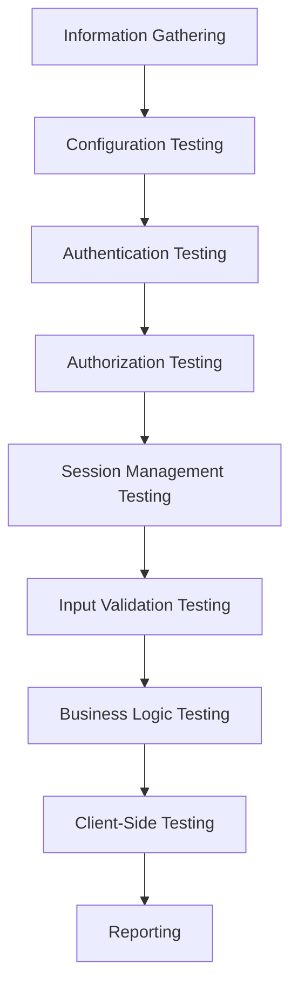
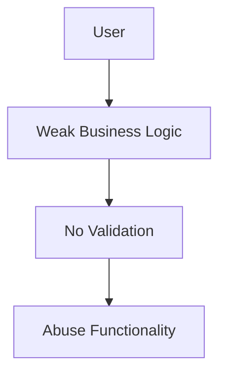
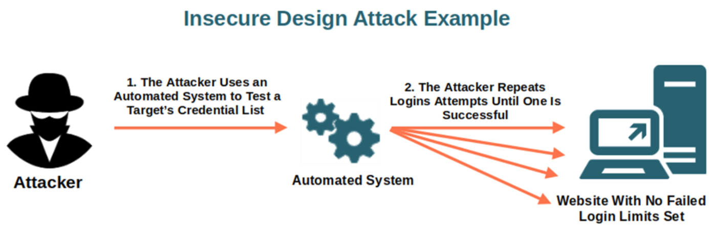
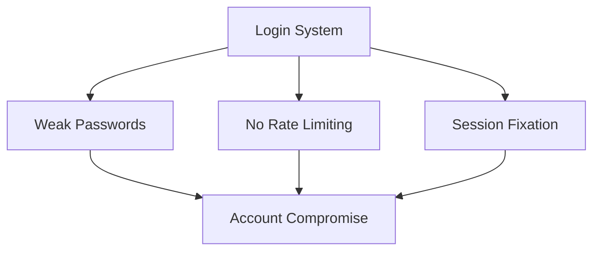
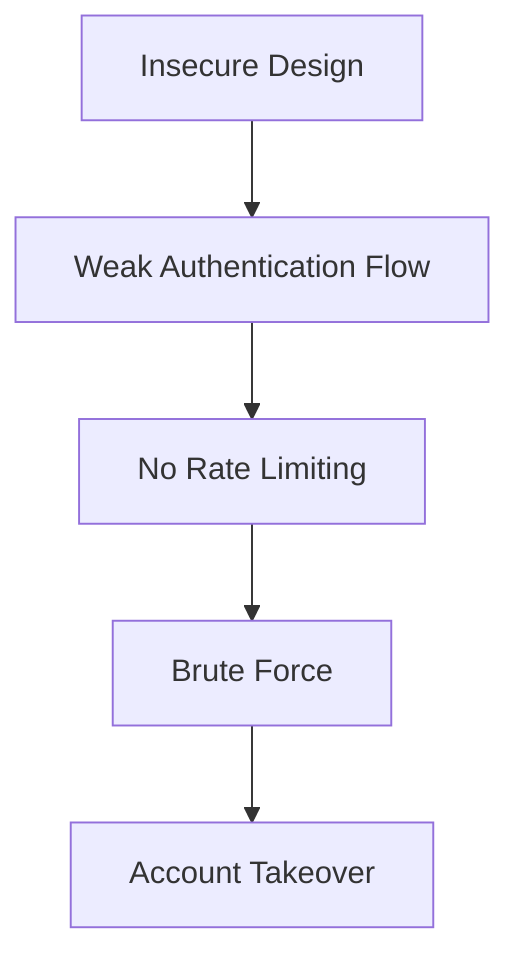

# Web Application Penetration Testing

---

## 1. Overview of Web Pentesting Methodology

Web application penetration testing is a **systematic process** of identifying, analyzing, and validating security weaknesses in web applications.

### Standard Methodology (OWASP WSTG + SANS)

---

## 2. Web Vulnerabilities (OWASP Top 10 Focus)

---

### 2.1 A04:2021 – Insecure Design

#### Definition

Insecure Design refers to **missing or ineffective security controls at the design phase**, not implementation bugs.

---

### Root Causes (OWASP + SANS)

- Lack of **threat modeling**
- No **secure design patterns**
- Missing **security requirements**
- Failure in **shift-left security**

---

### Common CWEs

| CWE ID | Description |
| --- | --- |
| CWE-209 | Information Exposure |
| CWE-522 | Insufficient Credential Protection |
| CWE-840 | Business Logic Errors |

---

### Attack Scenario

Example:

- No limit on password reset requests → account takeover

---

### Real Example

- Missing rate limiting → brute-force attack
- Weak workflow validation → bypass payment step

---

### Mitigation

- Implement **threat modeling (STRIDE)**
- Use **secure design patterns**
- Apply **least privilege principle**
- Validate workflows

---

"

---

---

### 2.2 A07:2021 – Identification and Authentication Failures

---

#### Definition

Failures in authentication, session management, or identity verification mechanisms.

---

### Key CWEs

| CWE | Description |
| --- | --- |
| CWE-287 | Improper Authentication |
| CWE-384 | Session Fixation |
| CWE-307 | Brute Force |
| CWE-306 | Missing Authentication |
| CWE-522 | Weak Credential Storage |

---

### Attack Tree

---

### Common Issues

- Weak passwords
- No MFA
- Credentials in plaintext
- Session IDs in URL
- Improper logout

---

### PortSwigger Attack Examples

- Brute-force login
- Credential stuffing
- MFA bypass
- Session reuse

---

### Mitigation

- Enforce **strong password policies**
- Implement **MFA**
- Use **secure hashing (bcrypt/argon2)**
- Regenerate session IDs
- Apply rate limiting

---

📸 **Screenshot Suggestion** Place in: `Screenshots/Web_Testing/` **Name:** login_bruteforce.png **Caption:** "Example of brute-force attack on login endpoint"

---

---

## 3. Testing Techniques

---

### 3.1 Manual vs Automated Testing

| Aspect | Manual Testing | Automated Testing |
| --- | --- | --- |
| Tools | Burp Suite | SQLMap, ZAP |
| Accuracy | High | Medium |
| Coverage | Deep | Broad |
| Use Case | Logic flaws | Injection detection |

---

---

### 3.2 OWASP WSTG Testing Categories

---

#### 1. Information Gathering (WSTG-INFO)

- Application fingerprinting
- Tech stack identification
- Entry point discovery

Example:

- Headers analysis
- Robots.txt enumeration

---

📸 Screenshot `Screenshots/Web_Testing/recon_headers.png` Caption: "Identifying server technology via HTTP headers"

---

---

#### 2. Configuration Testing (WSTG-CONF)

- Default credentials
- Misconfigurations
- Directory listing

---

#### 3. Authentication Testing (WSTG-SESS)

- Credential transport security
- Brute-force testing
- Session fixation

---

#### 4. Authorization Testing (WSTG-ACCESS)

- Horizontal privilege escalation
- Vertical privilege escalation

---

#### 5. Session Management (WSTG-SESS)

- Session timeout
- Token randomness
- Session invalidation

---

#### 6. Input Validation (WSTG-INPV)

Includes:

- SQL Injection
- XSS
- Command Injection
- Path Traversal
- XXE

---

### PortSwigger Vulnerability Taxonomy

---

#### SQL Injection Types

| Type | Description |
| --- | --- |
| In-band | Error-based |
| Blind | Boolean |
| Time-based | Delay response |
| Stacked | Multiple queries |

---

#### XSS Types

| Type | Description |
| --- | --- |
| Reflected | Immediate |
| Stored | Persistent |
| DOM | Client-side |

---

#### CSRF Types

- Login CSRF
- Multi-step CSRF
- Stored CSRF

---

#### Advanced Attacks

- SSRF
- Request Smuggling (CL.TE, TE.CL)
- Web Cache Deception
- NoSQL Injection

---

### 3.3 SANS Methodology (SEC542)

---

#### Recon & Mapping

- Nmap scanning
- Burp crawling
- Endpoint discovery

---

#### Authentication Attacks

- Weak credentials
- Shellshock
- Session flaws

---

#### Input Validation Failures

- SQLi
- XSS

---

#### Business Logic Testing

- Workflow bypass
- Payment manipulation

---

---

## 4. Secure Coding Mitigations

---

### 4.1 Input Validation (WSTG-INPV)

- Whitelisting inputs
- Output encoding
- Parameterized queries

---

### 4.2 Session Management (WSTG-SESS)

- No session IDs in URLs
- Secure cookies (HttpOnly, Secure)
- Proper timeout

---

### 4.3 Authentication Security

- MFA
- Rate limiting
- Secure password hashing

---

### 4.4 Cryptography (WSTG-CRYP)

- Use strong algorithms (AES, RSA)
- Avoid hardcoded keys
- Secure key storage

---

### 4.5 Error Handling

- Avoid stack traces
- Generic error messages

---

## 5. Integrated Theoretical Insight

---

### How A04 Leads to A07 Exploitation

---

### Key Understanding

- Poor design (A04) enables:
  
  - Authentication failures (A07)
    
  - Business logic flaws
    
- Attackers chain:
  
  - Input validation flaws
  - Session weaknesses
  - Access control issues

---

## Final Takeaway

- Web pentesting is **methodology-driven**
- OWASP WSTG provides **complete testing framework**
- PortSwigger defines **attack techniques**
- SANS provides **real-world application**

---
