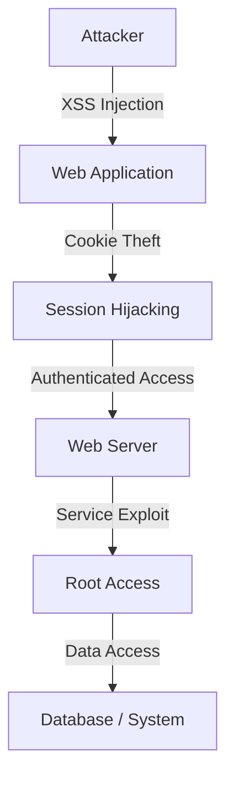

---

# **Vulnerability Assessment and Penetration Testing (VAPT) Report**

---

## **Executive Summary**

A comprehensive security assessment was conducted on the target web application hosted at **192.168.198.130**. Multiple critical vulnerabilities were identified, including SQL Injection, Cross-Site Scripting (XSS), weak authentication mechanisms, session hijacking, and a chained Remote Code Execution (RCE) attack.

Successful exploitation demonstrated complete system compromise, including unauthorized access and root-level control. These vulnerabilities pose significant risks such as data breaches, account takeover, and full infrastructure compromise. Immediate remediation is required.

---

## **Technical Findings**

---

### **F001: SQL Injection**

* **Severity:** Critical
* **CVSS Score:** 9.1
* **Location:** `/dvwa/vulnerabilities/sqli/`

**Description:**
The application does not properly validate user input in the `id` parameter, allowing manipulation of SQL queries.

**Impact:**

* Unauthorized database access
* Data extraction

---

### **F002: Cross-Site Scripting (XSS)**

* **Severity:** Medium
* **CVSS Score:** 6.1
* **Location:** `/dvwa/vulnerabilities/xss_r/`

**Description:**
User input is reflected without encoding, enabling execution of malicious scripts.

**Impact:**

* Session theft
* Client-side attacks

---

### **F003: Weak Password Policy**

* **Severity:** High
* **CVSS Score:** 7.5

**Description:**
The application allows weak passwords without enforcing complexity requirements.

**Impact:**

* Account compromise
* Brute force attacks

---

### **F004: Broken Authentication**

* **Severity:** High
* **CVSS Score:** 8.0

**Description:**
Authentication relies only on session cookies without additional validation.

**Impact:**

* Unauthorized access
* Authentication bypass

---

### **F005: Session Hijacking**

* **Severity:** Critical
* **CVSS Score:** 9.0

**Description:**
Session cookies are accessible via JavaScript and lack security flags.

**Impact:**

* Account takeover
* Privilege escalation

---

### **F006: Remote Code Execution (Chained Attack)**

* **Severity:** Critical
* **CVSS Score:** 9.8

**Description:**
A chained attack combining XSS, session hijacking, and service exploitation (vsftpd 2.3.4) resulted in remote code execution.

**Impact:**

* Full system compromise
* Root-level access

---

## **Remediation Plan**

---

### **SQL Injection**

* Use prepared statements
* Implement input validation
* Sanitize all inputs

---

### **XSS**

* Apply output encoding
* Use Content Security Policy (CSP)
* Validate user input

---

### **Weak Password Policy**

* Enforce strong passwords
* Enable multi-factor authentication
* Implement account lockout

---

### **Authentication Issues**

* Bind sessions to IP/User-Agent
* Regenerate session IDs after login
* Implement secure authentication flow

---

### **Session Hijacking**

* Enable HttpOnly and Secure flags
* Use HTTPS
* Implement session expiration

---

### **RCE / Service Exploits**

* Remove vulnerable services
* Apply security patches
* Close unnecessary ports

---

## **Findings Table**

| Finding ID | Vulnerability         | CVSS Score | Remediation                            |
| ---------- | --------------------- | ---------- | -------------------------------------- |
| F001       | SQL Injection         | 9.1        | Input validation, prepared statements  |
| F002       | XSS Reflected         | 6.1        | Output encoding, CSP                   |
| F003       | Weak Password Policy  | 7.5        | Strong passwords, MFA                  |
| F004       | Broken Authentication | 8.0        | Secure session handling                |
| F005       | Session Hijacking     | 9.0        | HttpOnly, Secure cookies               |
| F006       | RCE (Chained Attack)  | 9.8        | Patch services, remove vulnerabilities |

---

---

## **Manager Briefing (Non-Technical)**

The assessment identified serious security weaknesses that could allow attackers to access sensitive data and gain full control of the system. These issues may lead to data breaches, unauthorized account access, and disruption of services. The most critical risk involves complete system compromise. Immediate action is required to strengthen security, improve authentication, and update vulnerable components to protect business operations.

---

## **Conclusion**

The application contains multiple high and critical vulnerabilities that can be chained to achieve full system compromise. Immediate remediation and continuous security monitoring are strongly recommended.

---

