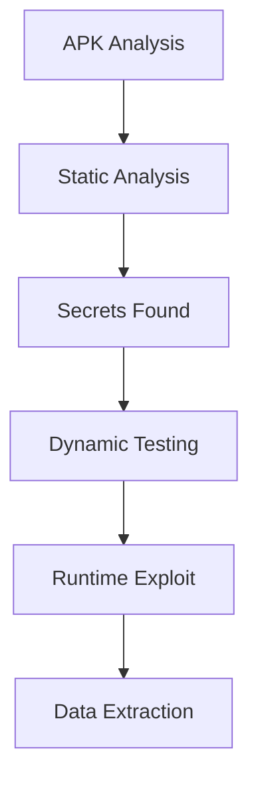

---
# Mobile Application Penetration Testing
---

## Overview

Mobile application penetration testing focuses on identifying vulnerabilities in Android and iOS applications based on the OWASP Mobile Top 10. Testing involves both static and dynamic analysis to uncover insecure storage, weak authentication, and runtime vulnerabilities.

Key focus areas:
- Static analysis (MobSF)
- Dynamic analysis (Frida)
- Reverse engineering
- Runtime manipulation
- Secure mobile design validation

---

## Complete Mobile Pentest Methodology

```typescript
Phase 1: Recon (APK extraction, MobSF upload)
Phase 2: Static Analysis (permissions, strings, code)
Phase 3: Dynamic Analysis (Frida, runtime hooks)
Phase 4: Binary Protections (obfuscation, anti-debugging)
Phase 5: Reporting (OWASP MSTG mapping)
```

---

## OWASP Mobile Top 10 Vulnerabilities

### M1: Improper Credential Usage

- Hardcoded API keys in source code
- Credentials stored in plaintext

Example:
```http
api_key=sk_live_xxx
```

---

### M2: Insecure Data Storage

#### Android Paths

```http
/data/data/<package>/databases/
/data/data/<package>/shared_prefs/
````

#### iOS Storage

- NSUserDefaults
- Keychain (misconfigured)

---

### M3: Insecure Communication

- HTTP traffic instead of HTTPS
- Weak certificate pinning
- Susceptible to MitM attacks

---

### M4: Insecure Authentication

- Weak session handling
- Token reuse
- Missing validation

---

### M5: Insufficient Cryptography

- Weak algorithms (MD5, AES ECB)
- Hardcoded encryption keys
- Static IV usage

---

### M6: Insecure Authorization

- Missing access control checks
- Horizontal and vertical privilege escalation

---

### M7: Client Code Quality

- Lack of input validation
- Improper exception handling

---

### M8: Code Tampering

- No integrity verification
- Repackaging attacks possible

---

### M9: Reverse Engineering

- No obfuscation
- Easy decompilation

---

### M10: Extraneous Functionality

- Debug endpoints
- Hidden admin features

---

## MobSF Static Analysis Workflow

### Setup

```bash
docker run -it -p 8000:8000 opensecurity/mobsf
````

---

### Analysis Pipeline

1. Upload APK file
2. Automated decompilation (apktool, jadx)
3. Permissions analysis
4. Code analysis (hardcoded secrets, crypto)
5. Malware scan
6. Generate report

---

## MobSF Analysis Checklist

```typescript
□ Permissions: INTERNET, READ_EXTERNAL_STORAGE
□ Certificate Analysis: Custom trust store
□ Hardcoded Secrets: API keys, tokens
□ Weak Cryptography: AES ECB, MD5
□ Debuggable Flag Enabled
□ Backup Enabled (android:allowBackup=true)
```

---

## Frida Dynamic Analysis

### SSL Pinning Bypass

```javascript
Java.perform(function() {
    var CertificatePinner = Java.use("okhttp3.CertificatePinner");
    CertificatePinner.check.overload('java.lang.String', '[Ljava.security.cert.Certificate;').implementation = function() {};
});
```

---

### Root Detection Bypass

```javascript
var Build = Java.use("android.os.Build");
Build.TAGS.value = "release-keys";
```

---

### SharedPreferences Hook

```javascript
var SharedPreferences = Java.use('android.content.SharedPreferences$Editor');
SharedPreferences.putString.overload('java.lang.String', 'java.lang.String').implementation = function(key, value) {
    console.log('[+] Key: ' + key + ' Value: ' + value);
    return this.putString(key, value);
};
```

---

## Advanced Frida Hooks

### Universal SSL Unpinning

```javascript
Java.perform(function() {
    try {
        var CertificatePinner = Java.use('okhttp3.CertificatePinner');
        CertificatePinner.check.overload('java.lang.String', 'java.util.List').implementation = function() {
            console.log('[+] SSL Pinning Bypassed');
        };
    } catch(e) {}
});
```

---

### Runtime Method Hooking

* Intercept sensitive functions
* Modify runtime behavior

---

## Dynamic Testing Workflow

1. Install APK on emulator/device
2. Configure proxy (Burp Suite)
3. Launch Frida server
4. Inject scripts
5. Monitor API calls
6. Extract sensitive data

---

## Binary Protections Analysis

### Obfuscation

* ProGuard
* DexGuard

Indicators:

* Randomized class names
* Control flow flattening

---

### Anti-Debugging

* Debug flag checks
* Emulator detection

---

### Integrity Checks

* Signature validation
* Hash verification

---

## Secure Mobile Design Mitigations

```typescript
□ Use Android Keystore for secure key storage
□ Encrypt databases using SQLCipher
□ Implement certificate pinning
□ Apply ProGuard obfuscation
□ Enable runtime integrity checks
```

---

## OWASP Mobile Top 10 Test Matrix

| Risk | Test Method          | MobSF Detection    | Frida Hook        |
| ---- | -------------------- | ------------------ | ----------------- |
| M1   | Hardcoded secrets    | Strings analysis   | Key extraction    |
| M2   | Storage analysis     | File paths         | DB hooks          |
| M3   | Traffic interception | Certificate issues | SSL bypass        |
| M7   | Code protection      | Obfuscation flags  | Anti-debug bypass |

---

## Mobile Attack Chain



---

## Lab Exercise

### Target

* InjuredAndroid / GoatDroid

---

### Steps

1. Upload APK to MobSF
2. Identify vulnerabilities
3. Decompile APK
4. Run Frida hooks
5. Bypass SSL pinning
6. Extract sensitive data
7. Document findings

---

## Key Takeaways

* Static + dynamic analysis is essential
* MobSF provides automated vulnerability detection
* Frida enables runtime manipulation
* Mobile apps often expose sensitive data
* Proper secure coding mitigates most vulnerabilities

---
