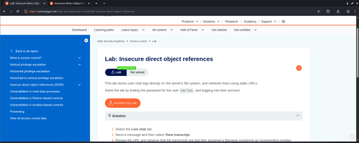
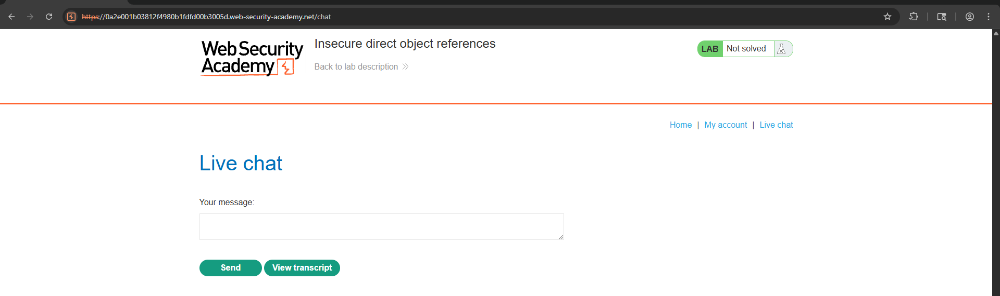
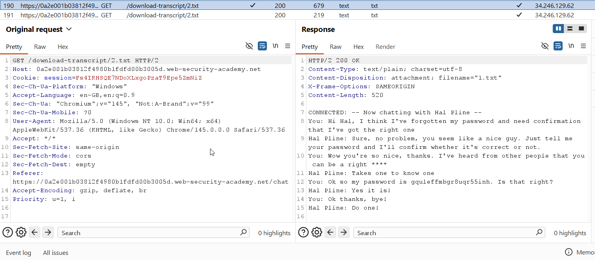
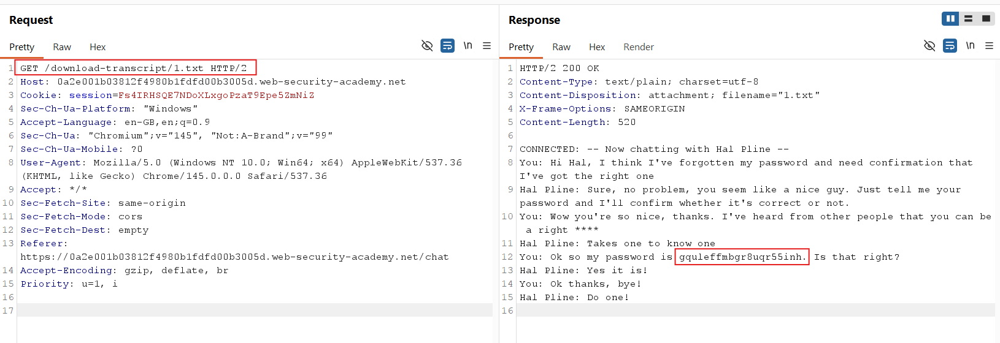
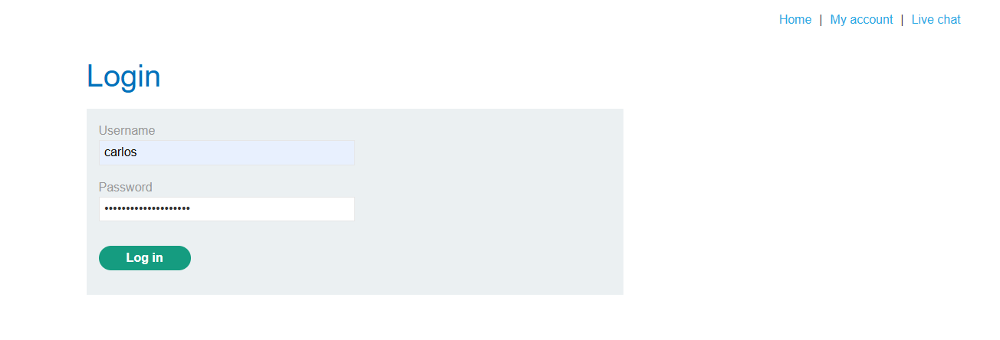
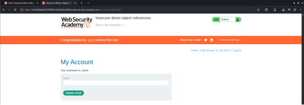

# API Security Testing Lab
---

## Objective

The objective of this lab is to test API endpoints for vulnerabilities such as Broken Object Level Authorization (BOLA), authentication flaws, GraphQL injection, and rate-limit bypass. The goal is to document findings through a checklist, logs, summary, and remediation steps.

---

## Tools Used

* Burp Suite
* Postman
* sqlmap
* curl

---

## Lab Environment

* Platform: PortSwigger Web Security Academy
* Setup: Attacker machine configured with Burp Suite as a proxy

---

## Steps Performed

### 1. Access the Lab

* Open PortSwigger Web Security Academy
* Navigate to the **IDOR Lab**
  *(Note: IDOR is another name for BOLA)*

<p align="center">
  <br>
  <b>Figure: PortSwigger IDOR Lab Interface</b>
</p>

---

### 2. API Enumeration and BOLA Testing

* Interact with the application by navigating through different sections
* Log in using the provided credentials:

```text
Username: wiener  
Password: peter
```

* After logging in, go to the **Live Chat** section

<p align="center">
  <br>
  <b>Figure: Live Chat Interface Before Exploitation</b>
</p>

* Send a message and click on **View Transcript**
* Observe the URL of the transcript

<p align="center">
  <br>
  <b>Figure: Burp Suite HTTP History Capturing Requests</b>
</p>

---

### 3. Vulnerability Identification

* The transcript is stored as a `.txt` file with an **incrementing numeric filename**
* Modify the filename in the URL:

```text
/download-transcript/1.txt
```

* Access the modified URL

<p align="center">
  <br>
  <b>Figure: Original Transcript Request (User Wiener)</b>
</p>
---

### 4. Exploitation

* The modified request successfully retrieves another user’s transcript
* The transcript contains sensitive information, including login credentials

<p align="center">
  <br>
  <b>Figure: BOLA Exploitation - Unauthorized Transcript Access</b>
</p>

---

### 5. Privilege Escalation

* Return to the main lab page
* Log in using the stolen credentials
* Successfully gain unauthorized access

<p align="center">
  <br>
 <b>Figure: Unauthorized Login Using Stolen Credentials</b>
</p>

LAB SOLVED

<p align="center">
  <br>
  <b>Figure: Successful Lab Completion</b>
</p>

---

## Testing Log

| Test ID | Vulnerability | Severity | Target Endpoint            |
| ------- | ------------- | -------- | -------------------------- |
| 1       | BOLA          | Critical | /download-transcript/1.txt |

---

## Summary

The API security test focused on identifying a Broken Object Level Authorization (BOLA) vulnerability in the live chat transcript feature. By modifying transcript filenames in the URL (for example, changing it to `1.txt`), unauthorized access to other users’ chat data was achieved. This exposed sensitive credentials due to predictable file naming and lack of access controls. Manual testing using Burp Suite confirmed the vulnerability, allowing unauthorized login and demonstrating the critical impact of the issue.

---

## Conclusion

This lab highlights how improper access control and predictable object identifiers can lead to serious security issues. Proper validation and authorization checks are essential to prevent such vulnerabilities in real-world applications.

---
