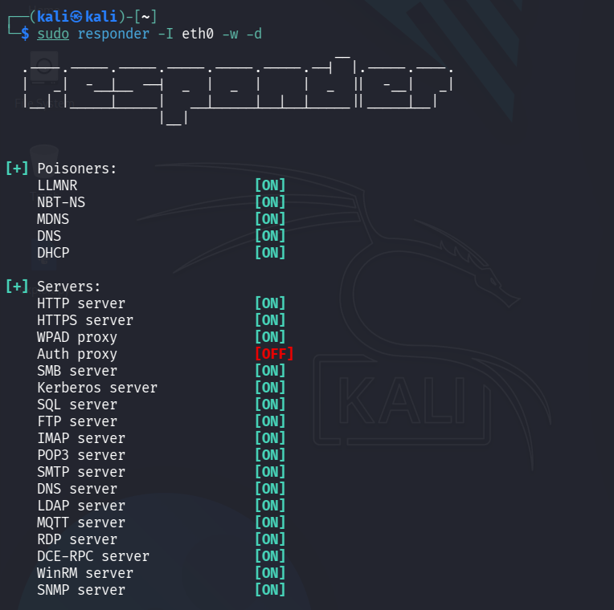
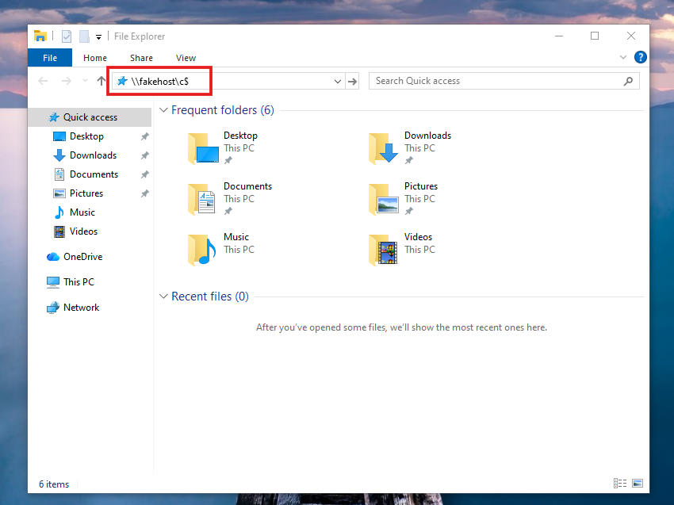
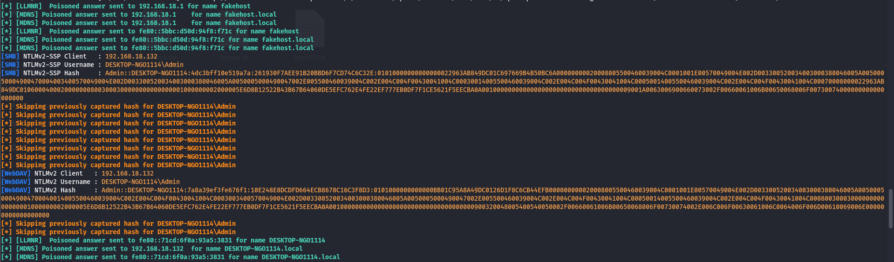
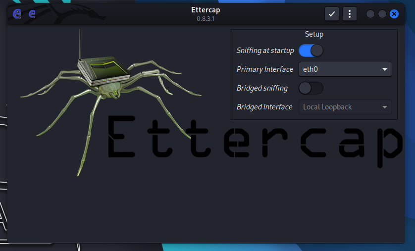
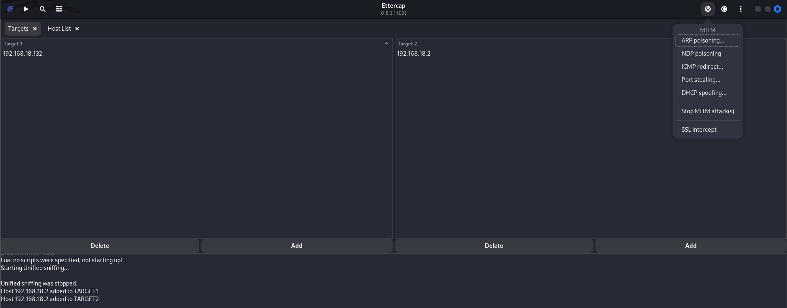
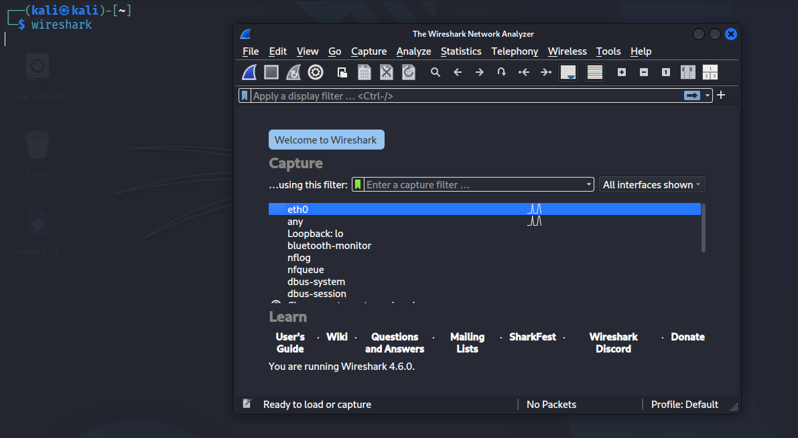
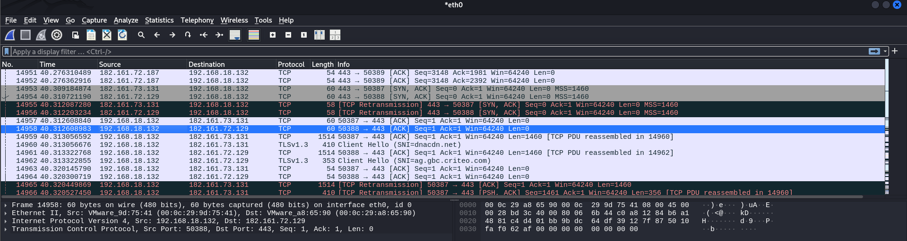
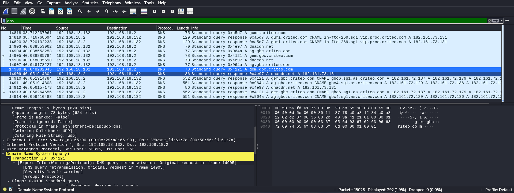
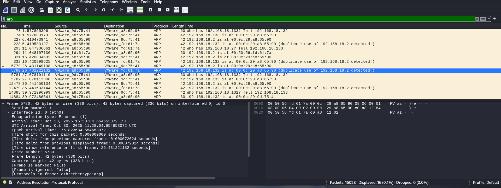

---
# Network Protocol Attacks Lab

---

## Objective

To perform network-based attacks including SMB relay, ARP spoofing (Man-in-the-Middle), and traffic analysis using tools such as Responder, Ettercap, and Wireshark.

---

## Lab Environment

**Attacker Machine:** Kali Linux (192.168.18.2)  
**Target Machine:** TryHackMe / Lab VM (192.168.18.132)  
**Tools Used:** Responder, Ettercap, Wireshark

---

## Phase 1: SMB Relay / NTLM Hash Capture (Responder)

### Step 1: Start Responder

```bash
sudo responder -I eth0 -w -d
````

---

### Explanation

| Flag      | Meaning              |
| --------- | -------------------- |
| `-I eth0` | Interface (eth0)     |
| `-w`      | WPAD poisoning       |
| `-d`      | DHCP/basic responses |

---

<p align="center">
  <br>
  <b>Figure 1: Running Responder</b>
</p>

---

### Target Machine

Wait for the target to initiate an SMB connection:

<p align="center">
  <br>
  <b>Figure 2: Target Machine Triggering SMB Request</b>
</p>

---

### Result

* Captured NTLM authentication hashes
* Victim machine attempted authentication
* Hashes logged in Responder output

<p align="center">
  <br>
  <b>Figure 3: NTLM Hash Captured</b>
</p>

---

## Attack Log

| Attack ID | Technique | Target IP      | Status  | Outcome   |
| --------- | --------- | -------------- | ------- | --------- |
| 01        | SMB Relay | 192.168.18.132 | Success | NTLM Hash |

---

## Phase 2: ARP Spoofing (MitM Attack)

### Step 1: Start Ettercap

```bash
sudo ettercap -G
```

<p align="center">
  <br>
  <b>Figure 4: Launching Ettercap GUI</b>
</p>

---

### Step 2: Configure Attack

* Select interface (eth0)
* Scan for hosts
* Add:

  * Target 1 → Victim
  * Target 2 → Gateway

<p align="center">
  <br>
  <b>Figure 5: Configuring Targets in Ettercap</b>
</p>

---

### Step 3: Start ARP Poisoning

```
Mitm → ARP Poisoning → Enable (Sniff Remote Connections)
```

---

## Phase 3: Traffic Analysis (Wireshark)

### Step 1: Start Wireshark

```bash
wireshark
```

<p align="center">
  <br>
  <b>Figure 6: Starting Wireshark</b>
</p>

---

### Captured Traffic

<p align="center">
  <br>
  <b>Figure 7: Captured Windows Traffic</b>
</p>

---

### Step 2: Apply Filters

```bash
http
dns
tcp
```

<p align="center">
  <br>
  <b>Figure 8: DNS Traffic Analysis</b>
</p>

<p align="center">
  <br>
  <b>Figure 9: ARP Traffic Observed</b>
</p>

---

### Result

* Captured network packets
* Observed HTTP/DNS traffic

---

## MitM Summary

ARP spoofing was performed using Ettercap to position the attacker between the victim and gateway. This allowed interception of network traffic, including sensitive data. Combined with Responder, NTLM hashes were captured. This demonstrates how network-level attacks can compromise confidentiality and enable credential harvesting in insecure environments.

---

## Checklist (Google Docs)

```
✓ Captured NTLM hashes using Responder  
✓ Performed ARP spoofing using Ettercap  
✓ Intercepted network traffic  
✓ Analyzed packets using Wireshark  
✓ Documented attack flow with screenshots  
```

---

## Findings

* NTLM authentication vulnerable to interception
* Network susceptible to ARP spoofing attacks
* Lack of encryption exposes sensitive data
* No detection mechanisms for MitM attacks

---

## Remediation

* Enable SMB signing
* Use encrypted protocols (HTTPS, SSH)
* Implement network segmentation
* Deploy intrusion detection systems (IDS)
* Enable Dynamic ARP Inspection (DAI)

---

## Conclusion

This lab demonstrated how attackers can exploit network protocols to intercept traffic and capture credentials. By combining Responder and ARP spoofing techniques, sensitive information can be extracted without direct system compromise. Proper network security controls are essential to prevent such attacks.

---
