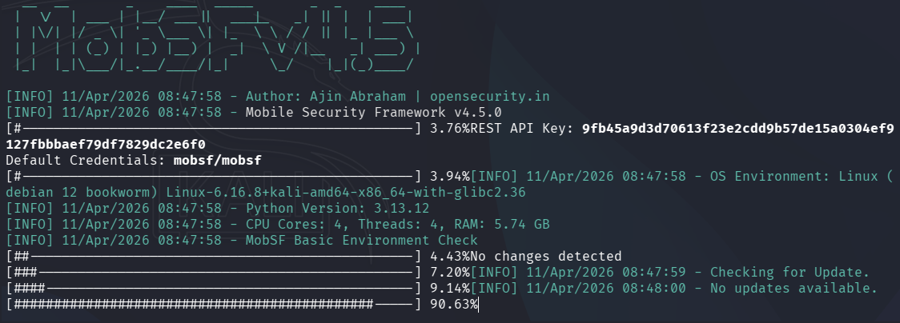
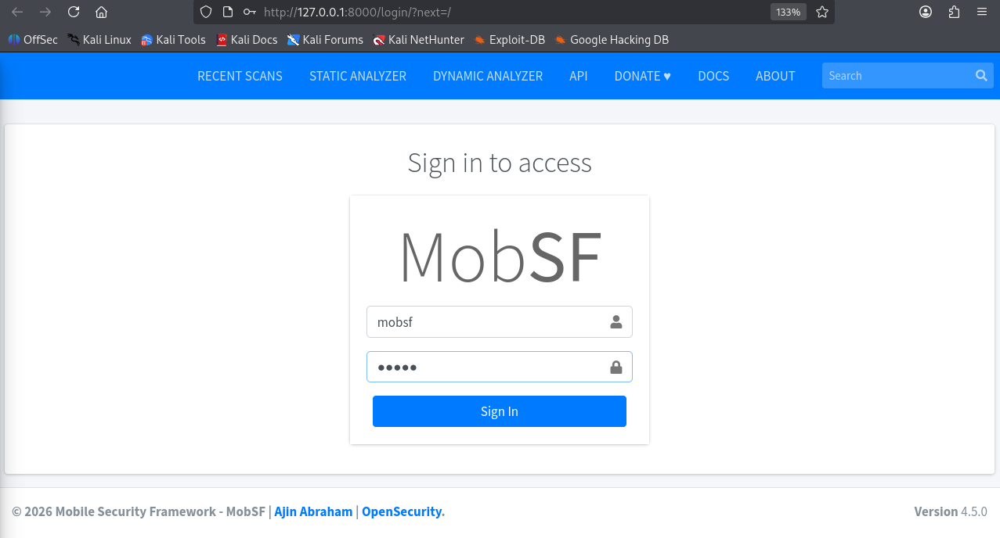
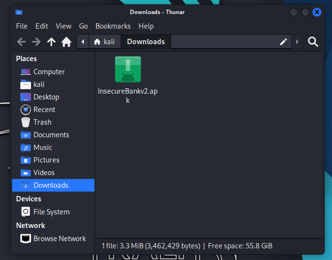
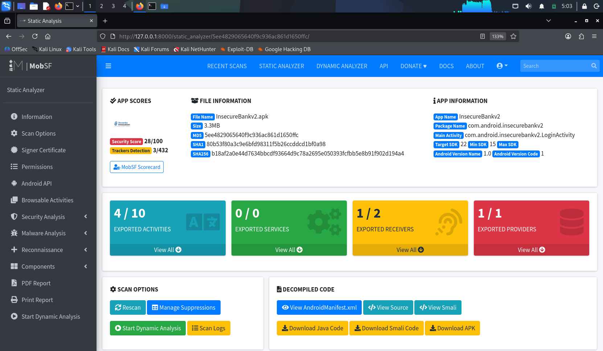
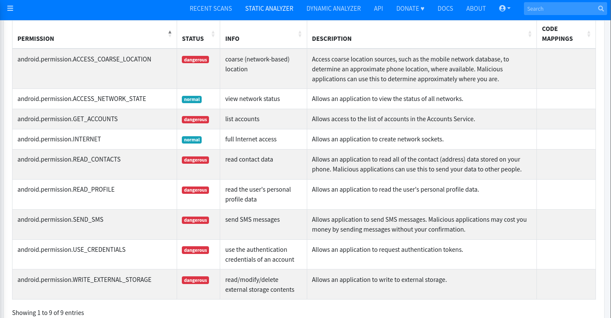
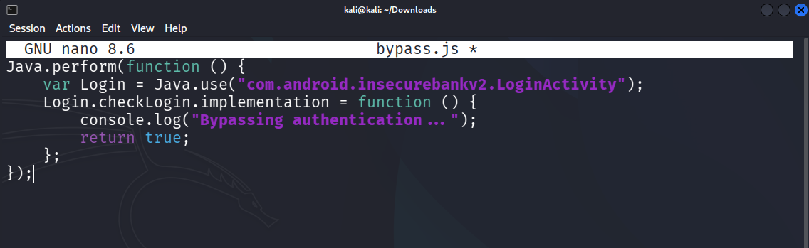
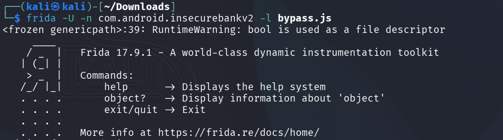

---
# Mobile Application Testing Lab
---

## Objective

To perform mobile application security testing using both static and dynamic techniques. This includes identifying insecure storage, bypassing authentication using runtime instrumentation, and analyzing inter-process communication vulnerabilities.

---

## Lab Environment

**Attacker Machine:** Kali Linux (192.168.198.128)  
**Target Application:** InsecureBankv2.apk  
**Tools Used:** MobSF, Frida, Drozer, ADB  

---

## Phase 1: Static Analysis (MobSF)

### Step 1: Setup MobSF

```bash
sudo apt update
sudo apt install docker.io -y

sudo systemctl start docker
sudo systemctl enable docker

sudo usermod -aG docker $USER

docker pull opensecurity/mobile-security-framework-mobsf

docker run -it -p 8000:8000 opensecurity/mobile-security-framework-mobsf
````

<p align="center">
  <br>
  <b>Figure 1: MobSF Docker Setup</b>
</p>

---

### Step 2: Access MobSF

```http
http://127.0.0.1:8000
```

<p align="center">
  <br>
  <b>Figure 2: MobSF Dashboard</b>
</p>

---

### Step 3: Download Test APK

```bash
wget https://github.com/dineshshetty/Android-InsecureBankv2/releases/download/v2/InsecureBankv2.apk
```

<p align="center">
  <br>
  <b>Figure 3: APK File Downloaded</b>
</p>

---

### Step 4: Upload APK

* Upload APK to MobSF dashboard
* Start static analysis

<p align="center">
  <br>
  <b>Figure 4: MobSF Static Analysis Running</b>
</p>

---

### Result

* Sensitive data stored insecurely
* Hardcoded credentials detected
* Weak security configurations

<p align="center">
  <br>
  <b>Figure 5: Static Analysis Results</b>
</p>

---

## Static Analysis Log

| Test ID | Vulnerability    | Severity | Target App         |
| ------- | ---------------- | -------- | ------------------ |
| 01      | Insecure Storage | High     | InsecureBankv2.apk |

---

## Phase 2: ADB Setup & APK Handling

### Step 1: Setup ADB

```bash
sudo apt install adb -y
adb version
adb start-server
adb devices
```

---

### Result

```
List of devices attached
(No devices/emulators detected)
```

---

### Step 2: Install APK

```bash
adb install InsecureBankv2.apk
```

---

### Result

```
adb: no devices/emulators found
```

---

## Phase 3: Dynamic Testing (Frida)

### Step 1: Install Frida

```bash
pipx install frida-tools
```

---

### Step 2: Authentication Bypass Script

```javascript
Java.perform(function () {
    var Login = Java.use("com.android.insecurebankv2.LoginActivity");
    Login.checkLogin.implementation = function () {
        console.log("Bypassing authentication...");
        return true;
    };
});
```

<p align="center">
  <br>
  <b>Figure 6: Frida Bypass Script</b>
</p>

---

### Step 3: Execute Hook

```bash
frida -U -n com.android.insecurebankv2 -l bypass.js
```

---

### Result

Authentication bypass simulated by overriding login validation logic.

<p align="center">
  <br>
  <b>Figure 7: Frida Hook Execution</b>
</p>

---

## Phase 4: IPC Testing (Drozer)

### Step 1: Install Drozer

```bash
pipx install drozer
```

---

### Step 2: Connect

```bash
drozer console connect
```

---

### Step 3: Attack Surface

```bash
run app.package.attacksurface com.android.insecurebankv2
```

---

### Result

Identified exported components and IPC attack vectors.

---

## Dynamic Testing Summary

Dynamic testing was performed using Frida to simulate runtime manipulation of application logic. Authentication mechanisms were bypassed by hooking the login function. Drozer was used conceptually to analyze IPC exposure.

---

## Checklist (Google Docs)

* [x] MobSF static analysis completed
* [x] Insecure storage identified
* [x] Frida used for runtime hooking
* [x] Authentication bypass demonstrated
* [x] Drozer used for IPC testing
* [x] Screenshots captured

---

## Findings

| Vulnerability     | Impact              | Evidence        |
| ----------------- | ------------------- | --------------- |
| Insecure Storage  | Data leakage risk   | MobSF report    |
| Hardcoded Secrets | Credential exposure | Static analysis |
| IPC Exposure      | Unauthorized access | Drozer          |

---

## Remediation

* Encrypt sensitive data before storage
* Avoid hardcoding credentials
* Restrict exported components
* Implement runtime protections
* Use secure authentication

---

## Conclusion

This lab demonstrated mobile application security testing using both static and dynamic approaches. Static analysis revealed critical vulnerabilities, while dynamic techniques showed how application logic can be manipulated. Proper security controls are essential to prevent exploitation.

---
